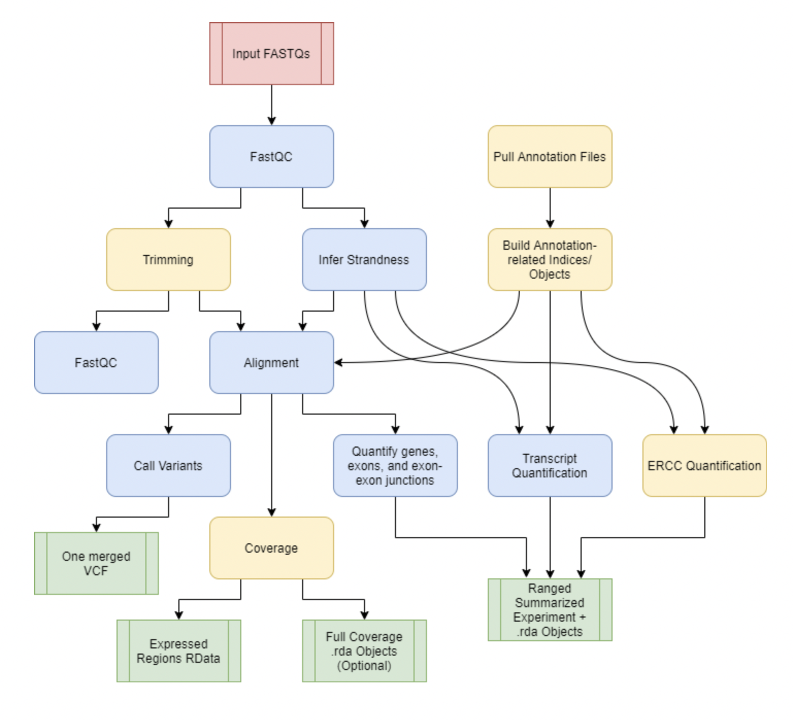
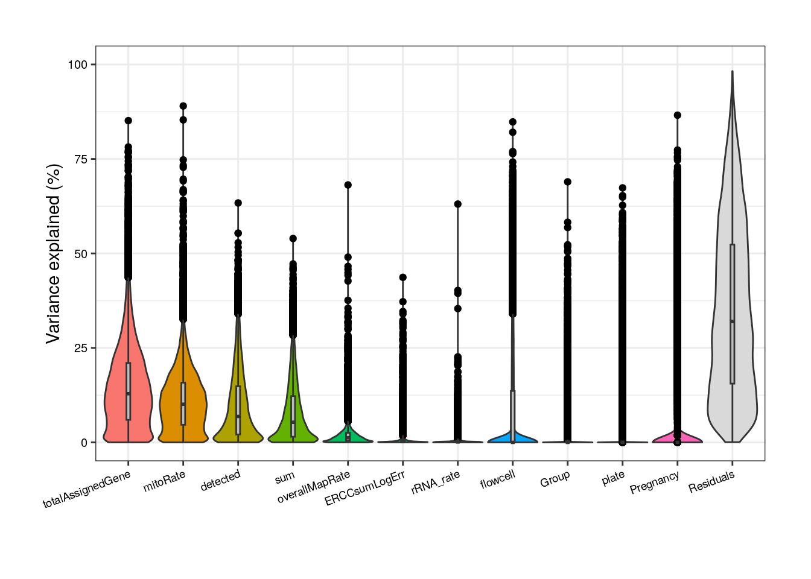
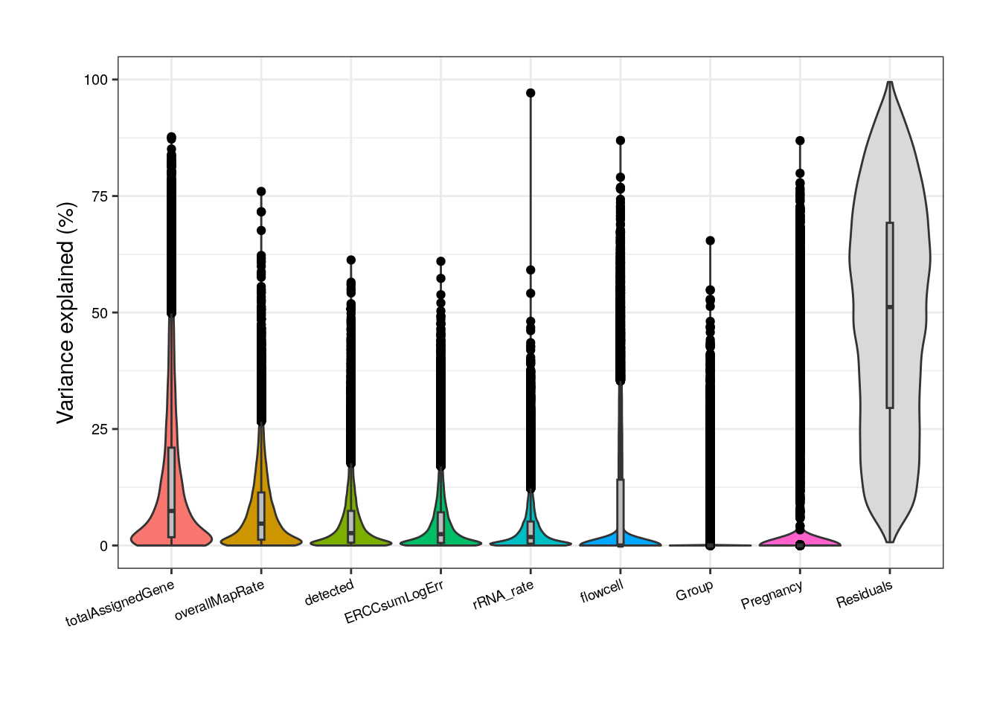
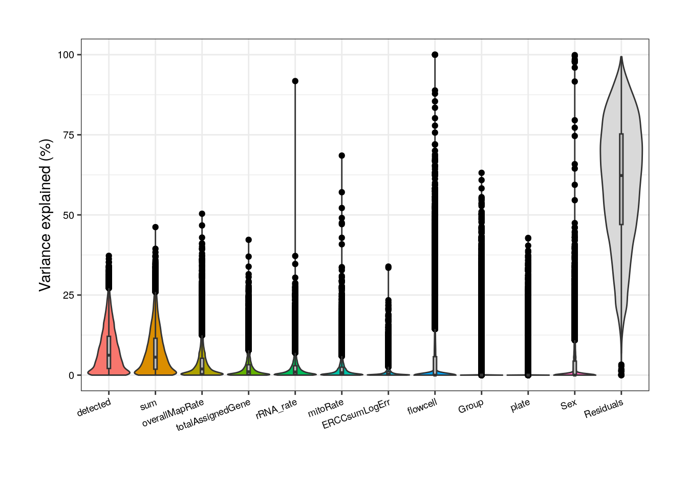
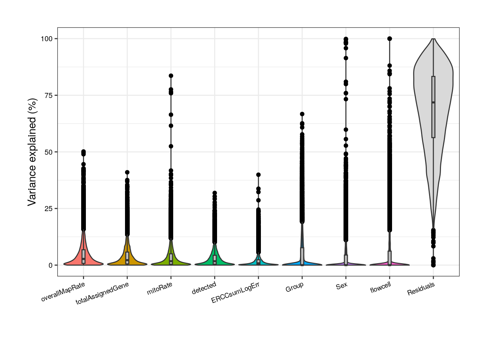

```{r, include = FALSE}
knitr::opts_chunk$set(
    collapse = TRUE,
    comment = "#>"
)
```

```{r vignetteSetup, echo=FALSE, message=FALSE, warning = FALSE}
## For links
library(BiocStyle)

## Track time spent on making the vignette
startTime <- Sys.time()

## Bib setup
library(RefManageR)

## Write bibliography information
bib <- c(
    BiocStyle = citation("BiocStyle")[1],
    circlize = citation("circlize")[1],
    ComplexHeatmap = citation("ComplexHeatmap")[1],
    cowplot = citation("cowplot")[1],
    dplyr = citation("dplyr")[1],
    edgeR = citation("edgeR")[1],
    ggplot2 = citation("ggplot2")[1],
    ggrepel = citation("ggrepel")[1],
    ggpubr = citation("ggpubr")[1],
    here = citation("here")[1],
    Hmisc = citation("Hmisc")[1],
    jaffelab = citation("jaffelab")[1],
    knitr = citation("knitr")[1],
    limma = citation("limma")[1],
    pheatmap = citation("pheatmap")[1],
    RefManageR = citation("RefManageR")[1],
    rlang = citation("rlang")[1],
    rmarkdown = citation("rmarkdown")[1],
    scater = citation("scater")[1],
    sessioninfo = citation("sessioninfo")[1],
    smokingMouse = citation("smokingMouse")[1],
    SPEAQeasy = citation("SPEAQeasyWorkshop2023")[2],
    stringr = citation("stringr")[1],
    SummarizedExperiment = citation("SummarizedExperiment")[1],
    variancePartition = citation("variancePartition")[1],
    voom = RefManageR::BibEntry(
        "article",
        key = "voom",
        author = "CW Law and Y Chen and W Shi and GK Smyth",
        year = "2014",
        title = "Voom: precision weights unlock linear model analysis tools for RNA-seq read counts",
        journal = "Genome Biology",
        volume = "15",
        pages = "R29"
    )
)
```

# Overview

This workshop aims to present the `SPEAQeasy` `r Citep(bib[["SPEAQeasy"]], .opts = list(max.names = 1))` RNA-seq processing pipeline, demonstrating how its outputs can be used in Differential Expression Analyses (DEA) and the type of results it enables to obtain using other Bioconductor R packages such as `r Biocpkg('limma')` and `r Biocpkg('edgeR')`.


## Description
In this demo, participants will be able to understand what the SPEAQeasy pipeline does and what it returns through a differential expression analysis performed on a dataset from the `smokingMouse` `r Citep(bib[["smokingMouse"]], .opts = list(max.names = 1))` Bioconductor package, which contains gene expression data and sample information from multiple RNA-sequencing experiments in mice. 


## Instructors

* [Daianna Gonzalez](https://daianna21.github.io)
* [Renee Garcia](https://reneegf.github.io)
* [Nick Eagles](https://nick-eagles.github.io)


## Pre-requisites

* General familiarity with bulk RNA-seq data.
* Basic knowledge of differential expression. 
* Basic experience handling `r Biocpkg('SummarizedExperiment')` and `r Biocpkg('GenomicRanges')` packages.
* Previous review of http://research.libd.org/smokingMouse/ for data explanation. (Optional)

## Participation
Participants are expected to follow us on the theoretical explanations and presentation of the code logic, but are not really expected to run code since some analyses take plenty of time. An active participation and opportune interventions are always welcome and enriching for the discussion. 

## _R_ / _Bioconductor_ packages used

- `r Biocpkg('SummarizedExperiment')`
- `r Biocpkg('smokingMouse')`
- `r Biocpkg('limma')`
- `r Biocpkg('edgeR')`
- `r Biocpkg('scater')`
- `r Biocpkg('variancePartition')`
- `r Biocpkg('ComplexHeatmap')`

## Time outline

| Activity                     | Time |
|------------------------------|------|
| Introduction to SPEAQeasy               | 25m |
| Data overview                           | 10m |
| Differential Expression Analysis        | 55m |

Total: a 90 minute session.

# Workshop goals and objectives

## Learning goals

The global goals of this workshop are:

* to understand the purpose of [SPEAQeasy](https://github.com/LieberInstitute/SPEAQeasy) and the type of data it produces;
* to learn what type of analyses can be done with [SPEAQeasy](https://github.com/LieberInstitute/SPEAQeasy) outputs;
* to understand techniques used to filter and normalize gene-expression data;
* to learn of quality control analyses and other type of exploratory data analyses;
* to understand how to identify suitable covariates for differential expression analyses, and
* to learn how to perform a differential expression analysis and how to visualize expression of DEGs.

## Learning objectives

As specific objectives we have:

* to use `r Biocpkg('ggplot2')` to assess bulk RNA-seq quality metrics for the `r Biocpkg('smokingMouse')` dataset stored in `r Biocpkg('SummarizedExperiment')` objects output by the [SPEAQeasy](https://github.com/LieberInstitute/SPEAQeasy) pipeline;
* use `r Biocpkg('variancePartition')` to perform a Canonical Correlation Analysis (CCA) on sample metadata with associated quality metrics and to compute the fraction of gene expression variance explained by each sample variable;
* to use `r Biocpkg('limma')` functions such as `voom()`, `lmFit()`, `eBayes()` and `topTable()` to find DEGs, and
* to use `r Biocpkg('ComplexHeatmap')` to create heatmaps of expression levels of DEGs, identifying clusters of up and downregulated genes. 


# SPEAQeasy overview

## Workflow

We introduce [SPEAQeasy](https://github.com/LieberInstitute/SPEAQeasy), a **S**calable RNA-seq processing **P**ipeline for **E**xpression **A**nalysis and **Q**uantification, that is **easy** to install, use, and share with others. More detailed documentation is [here](http://research.libd.org/SPEAQeasy/).


    <figcaption style="color: gray; line-height: 0.9; text-align: justify"><font size="-1.9"><b>Figure 1: Functional workflow. </b> Yellow coloring denotes steps which are optional or not always performed. </font> 

   </figcaption>
   
SPEAQeasy starts with raw sequencing outputs in FASTQ format and ultimately produces [RangedSummarizedExperiment](https://bioconductor.org/packages/release/bioc/html/SummarizedExperiment.html) objects with raw and normalized counts for each feature type: genes, exons, exon-exon junctions, and transcripts.


 <figcaption style="color: gray; line-height: 0.9; text-align: justify">
            <font size="-1.9">
                <b>Figure 2: SummarizedExperiment structure. </b>
            </font> 
   </figcaption>

### Optional steps

For human samples, variant calling is performed at a list of highly variable sites. A single [VCF file](https://www.internationalgenome.org/wiki/Analysis/Variant%20Call%20Format/vcf-variant-call-format-version-40/) is generated, containing genotype calls for all samples. This establishes a sufficiently unique profile for each sample which can be compared against pre-sequencing genotype calls to resolve potential identity issues.

Optionally, [BigWig](https://genome.ucsc.edu/goldenPath/help/bigWig.html) coverage files by strand, and averaged across strands, are produced. An additional step utilizes the [derfinder](https://bioconductor.org/packages/release/bioc/html/derfinder.html) package to compute expressed regions, a precursor to analyses finding differentially expressed regions (DERs).

## Installation

SPEAQeasy is available from GitHub, and can be cloned:

```{bash, eval=FALSE}
git clone git@github.com:LieberInstitute/SPEAQeasy.git
```

SPEAQeasy dependencies are recommended to be installed using Docker or Singularity, involving a fairly quick installation that is reproducible regardless of the computing environment. We'll install using Singularity, which is more frequently available in high-performance computing (HPC) environments:

```{bash, eval=FALSE}
#  From within the SPEAQeasy repository:
bash install_software.sh "singularity"
```

If neither Docker nor Singularity are available, a more experimental local installation of all dependencies is an option:

```{bash, eval=FALSE}
#  From within the SPEAQeasy repository:
bash install_software.sh "local"
```

Please note that installation may take some time-- **installing and running SPEAQeasy is not required for this workshop**, but is demonstrated to familiarize participants with the process. The workshop files include outputs from SPEAQeasy, which can be used later for the example differential expression analysis.

## Preparing a run

Choose a "main" script as appropriate for your particular set-up. "Main" scripts and associated configuration files exist for SLURM-managed computing clusters, SGE-managed clusters, local machines, and the [JHPCE](https://jhpce.jhu.edu/) cluster.

| Environment  | "Main" script | Config file |
|----------|-------------|-------------------|
| SLURM cluster   | run_pipeline_slurm.sh      | conf/slurm.config or conf/docker_slurm.config  |
| SGE cluster     | run_pipeline_sge.sh        | conf/sge.config or conf/docker_sge.config      |
| Local machine   | run_pipeline_local.sh      | conf/local.config or conf/docker_local.config  |
| JHPCE cluster   | run_pipeline_jhpce.sh      | conf/jhpce.config                              |

Within the main script, you can configure arguments specific to the experiment, such as the reference organism, pairing of samples, and where to place output files, among other specifications.

When running SPEAQeasy on a cluster (i.e. SLURM, SGE, or JHPCE users), it is recommended you submit the pipeline as a job, using the command appropriate for your cluster. For those running SPEAQeasy locally, the main script can be executed directly, ideally as a background task.

## Executing SPEAQeasy

```{bash, eval=FALSE}
#  SLURM-managed clusters
sbatch run_pipeline_slurm.sh

#  SGE-managed clusters
qsub run_pipeline_sge.sh

#  local machines
bash run_pipeline_local.sh

#  The JHPCE cluster
qsub run_pipeline_jhpce.sh
```

Here's an example of such a file:

```{r "example_run_file"}
example_main_script <- system.file(
    "extdata", "SPEAQeasy-example", "run_pipeline_jhpce.sh",
    package = "SPEAQeasyWorkshop2023"
)

cat(paste0(readLines(example_main_script), "\n"))
```


# Data overview and download 

The dataset that will be used for the DEA can be downloaded from the `smokingMouse` package. We will download the `rse_gene` object which contains the expression data at the gene level and is a direct output file of the SPEAQeasy pipeline. Visit [here](http://research.libd.org/smokingMouse/) for more details of the `smokingMouse` package.


    <figcaption style="color: gray; line-height: 0.85; text-align: justify"><font size="-1.9"><b>Figure 3</b>: <b>Experimental design of the study. </b> The data was obtained from an experiment in which <b>A)</b> 6 pregnant dams and 17 non-pregnant female adult mice were administered nicotine by intraperitoneal injection (IP; n=12) or controls (n=11). A total of 42 pups were born to pregnant dams: 19 were born to mice that were administered nicotine and 23 to control mice. Samples from frontal cortices of P0 pups and adults were obtained. <b>B)</b> RNA was extracted from those samples and then RNA-seq libraries were prepared and sequenced to obtain the expression counts of the genes. At the end, a dataset of 65 samples (either from adult or pup brain) and 55,401 genes was generated. </font> 

   </figcaption>


The data reside in a `RangedSummarizedExperiment` (RSE) object, containing the following assays:

* `counts`: original read counts of the 55,401 mouse genes across 208 samples (including the 65 nicotine samples).
* `logcounts`: normalized and scaled counts ($log_2(CPM + 0.5)$) of the same genes across the same samples; normalization was carried out applying TMM method with `cpm(calcNormFactors())` of `r BiocStyle::Biocpkg("edgeR")`.


The same RSE contains the sample information in `colData(RSE)` and the gene information in `rowData(RSE)`.

<mark style= "background-color: #FCF3CF"> Yellow </mark> variables correspond to SPEAQeasy outputs that are going to be used in downstream analyses. 

<mark style= "background-color: #FAECF8"> Pink </mark> variables are specific to the study, such as sample metadata and some others containing additional information about the genes. 

<mark style= "background-color: #DFF0FE"> Blue </mark> variables are quality-control metrics computed by `addPerCellQC()` of `r BiocStyle::Biocpkg("scuttle")`.


## Gene Information 

Among the information in `rowData(RSE)` the next variables are of interest for the analysis:

* <mark style= "background-color: #FCF3CF"> <span style="font-family: monospace"> gencodeID</span> </mark>: GENCODE ID of each gene.
* <mark style= "background-color: #FCF3CF"> <span style="font-family: monospace"> ensemblID</span> </mark>: gene ID in Ensembl database.
* <mark style= "background-color: #FCF3CF"> <span style="font-family: monospace"> EntrezID</span> </mark>: identifier of each gene in NCBI Entrez database.
* <mark style= "background-color: #FCF3CF"> <span style="font-family: monospace"> Symbol</span> </mark>:  official gene symbol for each mouse gene.
* <mark style= "background-color: #FAECF8"> <span style="font-family: monospace"> retained_after_feature_filtering</span> </mark>: Boolean variable that equals TRUE if the gene passed the gene filtering (with `filterByExpr()` of `r BiocStyle::Biocpkg("edgeR")`) based on its expression levels and FALSE if not.

## Sample Information 

Sample information in `colData(RSE)` contains the following variables:

* <mark style= "background-color: #FCF3CF"> <span style="font-family: monospace"> SAMPLE_ID</span> </mark>: is the name of the sample.
* <mark style= "background-color: #FCF3CF"> <span style="font-family: monospace"> ERCCsumLogErr</span> </mark>: a summary statistic quantifying overall difference of expected and actual ERCC concentrations for one sample. 
* <mark style= "background-color: #FCF3CF"> <span style="font-family: monospace"> overallMapRate</span> </mark>: the decimal fraction of reads which successfully mapped to the reference genome (i.e. *numMapped* / *numReads*).
* <mark style= "background-color: #FCF3CF"> <span style="font-family: monospace"> mitoMapped</span> </mark>: the number of reads which successfully mapped to the mitochondrial chromosome.
* <mark style= "background-color: #FCF3CF"> <span style="font-family: monospace"> totalMapped</span> </mark>: the number of reads which successfully mapped to the canonical sequences in the reference genome (excluding mitochondrial chromosomes).
* <mark style= "background-color: #FCF3CF"> <span style="font-family: monospace"> mitoRate</span> </mark>: the decimal fraction of reads which mapped to the mitochondrial chromosome, of those which map at all (i.e. *mitoMapped* / (*totalMapped* + *mitoMapped*))
* <mark style= "background-color: #FCF3CF"> <span style="font-family: monospace"> totalAssignedGene</span> </mark>: the decimal fraction of reads assigned unambiguously to a gene (including mitochondrial genes), with `featureCounts` (Liao et al. 2014), of those in total.
* <mark style= "background-color: #FCF3CF"> <span style="font-family: monospace"> rRNA_rate</span> </mark>: the decimal fraction of reads assigned to a gene whose type is ‘rRNA’, of those assigned to any gene.
* <mark style= "background-color: #FAECF8"> <span style="font-family: monospace"> Tissue</span> </mark>: tissue (mouse brain or blood) from which the sample comes.
* <mark style= "background-color: #FAECF8"> <span style="font-family: monospace"> Age</span> </mark>: if the sample comes from an adult or a pup mouse.
* <mark style= "background-color: #FAECF8"> <span style="font-family: monospace"> Sex</span> </mark>: if the sample comes from a female (F) or male (M)  mouse.
* <mark style= "background-color: #FAECF8"> <span style="font-family: monospace"> Expt</span> </mark>:  the experiment (nicotine or smoking exposure) to which the sample mouse was subjected; it could be an exposed or a control mouse of that experiment.
* <mark style= "background-color: #FAECF8"> <span style="font-family: monospace"> Group</span> </mark>: if the sample belongs to a nicotine/smoking-exposed mouse (Expt) or a nicotine/smoking control mouse (Ctrl).
* <mark style= "background-color: #FAECF8"> <span style="font-family: monospace"> plate</span> </mark>: is the plate (1,2 or 3) in which the sample library was prepared.
* <mark style= "background-color: #FAECF8"> <span style="font-family: monospace"> Pregnancy</span> </mark>:  if the sample comes from a pregnant (Yes) or not pregnant (No) mouse.
* <mark style= "background-color: #FAECF8"> <span style="font-family: monospace"> medium</span> </mark>: is the medium in which the sample was treated: water for brain samples and an elution buffer (EB) for the blood ones.
* <mark style= "background-color: #FAECF8"> <span style="font-family: monospace"> flowcell</span> </mark>: is the sequencing batch of each sample.
* <mark style= "background-color: #DFF0FE"> <span style="font-family: monospace"> sum</span> </mark>: library size (total sum of counts across all genes for each sample).
* <mark style= "background-color: #DFF0FE"> <span style="font-family: monospace"> detected</span> </mark>: number of non-zero expressed genes in each sample.

<div class="alert alert-info">
  <strong>Note:</strong> in our case, we'll use samples from the nicotine experiment only, so all samples come from brain and were treated in water.
</div>

```{r "examine_outputs"}
library(SummarizedExperiment)

## Connect to ExperimentHub
library(ExperimentHub)
eh <- ExperimentHub::ExperimentHub()

################################
#         Retrieve data
################################
## Load the datasets of the package
myfiles <- query(eh, "smokingMouse")

## Download the mouse gene data
rse_gene <- myfiles[["EH8313"]]

## Explore complete rse_gene object (including smoking-exposed samples as well)
rse_gene

#################################
##   Extract data of interest
#################################
## Keep samples from nicotine experiment only
rse_gene_nic <- rse_gene[, which(rse_gene$Expt == "Nicotine")]
## New dimensions
dim(rse_gene_nic)

#################################
##  Access gene expression data
#################################

## Raw counts for first 3 genes in the first 5 samples
assays(rse_gene_nic)$counts[1:3, 1:5]
## Log-normalized counts for first 3 genes in the first 5 samples
assays(rse_gene_nic)$logcounts[1:3, 1:5]

#################################
##     Access sample data
#################################

## Info for the first 2 samples
head(colData(rse_gene_nic), 2)
```

# Differential Expression Analysis

In this workshop we'll guide you through a differential expression analysis following the steps presented in **Figure 4**. The main objective is to determine which genes are affected by nicotine administration (in adults) or exposure (in pups) in the mouse brain. 

<figure>
    
        <figcaption style="color: gray; line-height: 0.9; text-align: justify">
            <font size="-1.8">
                <b>Figure 4</b>: <b> Summary of the analyses. </b> Steps in yellow will be properly performed. 
                 1. Data Preparation 2. Exploratory Data Analysis 3. Differential Expression Analysis  4. DEG visualization. 
            </font> 
            <font size="0.8"> Abbreviations: CPM: counts per million; QC: quality control; PC: principal component; 
            DEG: differentially expressed genes.</font>
        </figcaption>
</figure>

## **1. Data preparation** {-}
Before exploring a dataset, normalization and filtering steps are generally appropriate. In our case, SPEAQeasy outputs contain normalized counts, and the example data we'll use already has non-expressed genes filtered out. 

### 1.1 Data normalization {-}

Data normalization is a preliminary step when working with expression data because raw counts do not necessarily reflect real expression measures of the genes, since there are technical differences in the way the libraries are prepared and sequenced, as well as intrinsic differences in the genes that are translated into more or less mapped reads. Particularly, there are *within-sample effects* that are the differences between genes in the same sample, such as their **length** (the longer the gene, the more reads it will have) and **GC content**, factors that contribute to variations in their counts. On the other hand, *between-sample effects* are differences between samples such as the **sequencing depth**, i.e., the total number of molecules sequenced, and the **library size**, i.e., the total number of reads of each sample [1].

These variables lead to significantly different mRNA amounts but of course are not due to the biological or treatment conditions of interest (such as nicotine administration in this example) so in order to remove, or at least, to minimize this technical bias and obtain measures comparable and consistent across samples, raw counts must be normalized by these factors. The data that we'll use in this case are already normalized in `assays(rse_gene)$logcounts`. Specifically, the assay contains counts per million (CPM), also known as reads per million (RPM), one basic gene expression unit that only normalizes by the sequencing depth and is computed by dividing the read counts of a gene in a sample by a scaling factor given by the total mapping reads of the sample per million [2]:

$$CPM = \frac{read \ \ counts \ \ of \ \ gene \ \ \times \ \ 10^6 }{Total \ \ mapping \ \ reads \ \ of \ \ sample}$$ 


As outlined in **Data overview and download**, the scaling factors were obtained with `calcNormFactors()` applying the Trimmed Mean of M-Values (TMM) method, the `r BiocStyle::Biocpkg("edgeR")` package's default normalization method that assumes that most genes are not differentially expressed. The effective library sizes of the samples and the CPM of each observation were computed with the `r BiocStyle::Biocpkg("edgeR")` function `cpm()` setting the `log` argument to `TRUE` and `prior.count` to 0.5 to receive values in $log_2(CPM+0.5)$.

After data normalization and scaling, we’d expect the read counts to follow a normal distribution, something we can confirm by comparing the counts' distribution before and after the normalization. Note that both datasets contain the exact same genes.

```{r "Data preparation", message=FALSE, warning=FALSE}
library(ggplot2)

## Histogram and density plot of read counts before and after normalization

## Raw counts
counts_data <- data.frame(counts = as.vector(assays(rse_gene_nic)$counts))
plot <- ggplot(counts_data, aes(x = counts)) +
    geom_histogram(colour = "black", fill = "lightgray") +
    labs(x = "read counts", y = "Frecuency") +
    theme_classic() +
    theme(plot.margin = unit(c(2.5, 5, 2.5, 5), "cm"))
plot

## Normalized counts
logcounts_data <- data.frame(logcounts = as.vector(assays(rse_gene_nic)$logcounts))
plot <- ggplot(logcounts_data, aes(x = logcounts)) +
    geom_histogram(aes(y = ..density..), colour = "darkgray", fill = "lightgray") +
    theme_classic() +
    geom_density(fill = "#69b3a2", alpha = 0.3) +
    labs(x = "log(CPM+0.5)", y = "Frecuency") +
    theme(plot.margin = unit(c(2.5, 5, 2.5, 5), "cm"))
plot
```

As presented, after data transformation, we can now see a more widespread distribution of the counts, but note that most of them are zeros in the first plot (the one with the raw counts) and those zeros remain after normalization, corresponding to counts below 0 in the second plot. That is because we haven't filtered the lowly and zero-expressed genes. 


### 1.2 Gene filtering {-}

Lowly-expressed or non-expressed genes in many samples are not of biological interest in a study of differential expression because they don't inform about the gene expression changes and they are, by definition, not differentially expressed, so we have to drop them using `filterByExpr()` from `r BiocStyle::Biocpkg("edgeR")` that only keeps genes with at least *K* CPM in *n* samples and with a minimum total number of counts across all samples.

```{r,  message=FALSE, warning=FALSE}
## Retain genes that passed filtering step
rse_gene_filt <- rse_gene_nic[rowData(rse_gene_nic)$retained_after_feature_filtering == TRUE, ]

## Normalized counts and filtered genes
filt_logcounts_data <- data.frame(logcounts = as.vector(assays(rse_gene_filt)$logcounts))

## Plot
plot <- ggplot(filt_logcounts_data, aes(x = logcounts)) +
    geom_histogram(aes(y = ..density..), colour = "darkgray", fill = "lightgray") +
    theme_classic() +
    geom_density(fill = "#69b3a2", alpha = 0.3) +
    labs(x = "log(CPM+0.5)", y = "Frecuency") +
    theme(plot.margin = unit(c(2.5, 5, 2.5, 5), "cm"))
plot
```

In this third plot we can observe a curve that is closer (though not completely) to a normal distribution and with less lowly-expressed genes. 

With the object `rse_gene_filt` we can proceed with downstream analyses. 


## **2. Exploratory Data Analysis** {-}
The first formal step that we will be performing is the sample exploration. This crucial initial part of the analysis consists of an examination of differences and relationships between Quality-Control (QC) metrics of the samples from different groups in order to identify poor-quality samples that must be removed before DEA. After that, we will evaluate the similarities and grouping (not clustering) of the samples by their gene expression variation through a dimensionality reduction analysis. Finally, the sample variables in the metadata also need to be analyzed and filtered based on the percentage of gene expression variance that they explain for each gene. 


### 2.1 Quality Control Analysis {-}

First we have to explore and compare the quality-control metrics of the samples in the different groups given by covariates such as age, sex, pregnancy state, group, plate and flowcell. See **Sample Information** for a description of these variables.  

<style>
p.comment {
background-color: #DBDBDB;
padding: 10px;
border: 1px solid black;
border-radius: 5px;
font-family: sans-serif;
}

</style>

<p class="comment">
❓ ***Why is that relevant?*** As you could imagine, technical and methodological differences in all the steps that were carried out during the experimental stages are potential sources of variation in the quality of the samples. Just imagine all that could have been gone wrong or unexpected while experimenting with mice, during the sampling, in the RNA extraction using different batches, when treating samples in different mediums, when preparing libraries in different plates and sequencing in different flowcells. Moreover, the inherent features of the mice from which the samples come from such as age, tissue, sex and pregnancy state could also affect the samples' metrics if, for example, they were separately analyzed and processed. 
</p>


<p class="comment">
❓***But why do we care about mitochondrial and ribosomal counts as QC metrics?*** In the process of mRNA extraction, either by mRNA enrichment (capturing polyadenylated mRNAs) or rRNA-depletion (removing rRNA), we’d expect to have a low number of ribosomal counts, i.e., counts that map to rDNA, and if we don’t, something must have gone wrong with the procedures. In the case of mitochondrial counts something similar occurs: higher mitochondrial rates will be obtained if the cytoplasmic mRNA capture was deficient or if the transcripts were lost by some technical issue, increasing the proportion of mitochondrial mRNAs. As a result, high <mark style= "background-color: #FCF3CF"> <span style="font-family: monospace"> mitoRate</span> </mark> and <mark style= "background-color: #FCF3CF"> <span style="font-family: monospace"> rRNA_rate</span> </mark> imply poor quality in the samples.
</p>


<div class="alert alert-info">
  <strong>Note:</strong> the QC metrics were computed with the unprocessed datasets (neither filtered nor normalized) to preserve the original estimates of the samples.
</div>


#### *2.1.1 Evaluate QC metrics for groups of samples* {-}

Fortunately, we can identify to some extent possible factors that could have influenced on the quality of the samples, as well as isolated samples that are problematic. To do that, we will create boxplots that present the distribution of the samples' metrics separating them by sample variables. 

```{r "QC_boxplots",  message=FALSE, warning=FALSE}
library(Hmisc)
library(stringr)
library(cowplot)

## Define QC metrics of interest
qc_metrics <- c("mitoRate", "overallMapRate", "totalAssignedGene", "rRNA_rate", "sum", "detected", "ERCCsumLogErr")

## Define sample variables of interest
sample_variables <- c("Group", "Age", "Sex", "Pregnancy", "plate", "flowcell")


## Function to create boxplots of QC metrics for groups of samples

QC_boxplots <- function(qc_metric, sample_var) {
    ## Define sample colors depending on the sample variable
    if (sample_var == "Group") {
        colors <- c("Control" = "brown2", "Experimental" = "deepskyblue3")
    } else if (sample_var == "Age") {
        colors <- c("Adult" = "slateblue3", "Pup" = "yellow3")
    } else if (sample_var == "Sex") {
        colors <- c("F" = "hotpink1", "M" = "dodgerblue")
    } else if (sample_var == "Pregnancy") {
        colors <- c("Yes" = "darkorchid3", "No" = "darkolivegreen4")
    } else if (sample_var == "plate") {
        colors <- c("Plate1" = "darkorange", "Plate2" = "lightskyblue", "Plate3" = "deeppink1")
    } else if (sample_var == "flowcell") {
        colors <- c(
            "HKCG7DSXX" = "chartreuse2", "HKCMHDSXX" = "magenta", "HKCNKDSXX" = "turquoise3",
            "HKCTMDSXX" = "tomato"
        )
    }

    ## Axis labels
    x_label <- capitalize(sample_var)
    y_label <- str_replace_all(qc_metric, c("_" = ""))

    ## x-axis text angle and position
    if (sample_var == "flowcell") {
        x_axis_angle <- 18
        x_axis_hjust <- 0.5
        x_axis_vjust <- 0.7
        x_axis_size <- 4
    } else {
        x_axis_angle <- 0
        x_axis_hjust <- 0.5
        x_axis_vjust <- 0.5
        x_axis_size <- 6
    }

    ## Extract sample data in colData(rse_gene_filt)
    data <- data.frame(colData(rse_gene_filt))

    ## Sample variable separating samples in x-axis and QC metric in y-axis
    ## (Coloring by sample variable)
    plot <- ggplot(data = data, mapping = aes(x = !!rlang::sym(sample_var), y = !!rlang::sym(qc_metric), color = !!rlang::sym(sample_var))) +
        ## Add violin plots
        geom_violin(alpha = 0, size = 0.4, color = "black", width = 0.7) +
        ## Spread dots
        geom_jitter(width = 0.08, alpha = 0.7, size = 1.3) +
        ## Add boxplots
        geom_boxplot(alpha = 0, size = 0.4, width = 0.1, color = "black") +
        ## Set colors
        scale_color_manual(values = colors) +
        ## Define axis labels
        labs(y = y_label, x = x_label) +
        ## Get rid of the background
        theme_bw() +
        ## Hide legend and define plot margins and size of axis title and text
        theme(
            legend.position = "none",
            plot.margin = unit(c(0.5, 0.4, 0.5, 0.4), "cm"),
            axis.title = element_text(size = 7),
            axis.text = element_text(size = x_axis_size),
            axis.text.x = element_text(angle = x_axis_angle, hjust = x_axis_hjust, vjust = x_axis_vjust)
        )


    return(plot)
}


## Plots of all QC metrics for each sample variable
multiple_QC_boxplots <- function(sample_var) {
    i <- 1
    plots <- list()
    for (qc_metric in qc_metrics) {
        ## Call function to create each individual plot
        plots[[i]] <- QC_boxplots(qc_metric, sample_var)
        i <- i + 1
    }
    ## Arrange multiple plots into a grid
    print(plot_grid(plots[[1]], plots[[2]], plots[[3]], plots[[4]], plots[[5]], plots[[6]], plots[[7]], nrow = 2))
}
```


```{r message=FALSE, warning=FALSE}
multiple_QC_boxplots("Age")
```

Initially, when we separate samples by Age, we can appreciate a clear segregation of adult and pup samples in <mark style= "background-color: #FCF3CF"> <span style="font-family: monospace"> mitoRate</span> </mark>, with higher mitochondrial rates for adult samples and thus, being lower quality samples than the pup ones. We can also see that pup samples have higher <mark style= "background-color: #FCF3CF"> <span style="font-family: monospace"> totalAssignedGene</span> </mark>, again being higher quality. The samples are very similar in the rest of the QC metrics.
The former differences must be taken into account because they guide further sample separation by Age, which is necessary to avoid dropping most of the adult samples (that are lower quality) in the **QC-based sample filtering** (see below) and to prevent misinterpreting sample variation given by quality and not by mouse age itself. 

```{r message=FALSE, warning=FALSE}
multiple_QC_boxplots("Group")
```

Notably, for Group no evident contrasts are seen in the quality of the samples, which means that both control and exposed samples have similar metrics and therefore the differences between them won't be determined by technical factors but effectively by gene expression changes. 


```{r message=FALSE, warning=FALSE}
multiple_QC_boxplots("plate")
```

In plate, no alarming differences are presented but some samples from the 1st plate
have low (though not much lower) <mark style= "background-color: #FCF3CF"> <span style="font-family: monospace"> overallMapRate</span> </mark>,  <mark style= "background-color: #FCF3CF"> <span style="font-family: monospace"> totalAssignedGene</span> </mark> and <mark style= "background-color: #DFF0FE"> <span style="font-family: monospace"> sum</span> </mark>. 

```{r message=FALSE, warning=FALSE}
multiple_QC_boxplots("flowcell")
```

For the flowcell, again no worrying distinctions are seen, with the exception of a few individual samples far from the rest. 


#### *2.1.2 QC sample filtering* {-}

After assessing how different or similar are the QC values between samples, we can now proceed to sample filtering based precisely, on these metrics. For that, we will use `isOutlier()` from `r BiocStyle::Biocpkg("scater")` to identify outlier samples only at the lower end or the higher end, depending on the QC metric.

```{r "QC sample filtering", message=FALSE, warning=FALSE}
library(scater)
library(rlang)
library(ggrepel)

## Separate data by Age
rse_gene_pups <- rse_gene_filt[, which(rse_gene_filt$Age == "Pup")]
rse_gene_adults <- rse_gene_filt[, which(rse_gene_filt$Age == "Adult")]


## Find outlier samples based on their QC metrics (samples that are 3 median-absolute-deviations away from the median)


## Filter all samples together

## Drop samples with lower library sizes (sum), detected number of genes and totalAssignedGene
outliers_library_size <- isOutlier(rse_gene_filt$sum, nmads = 3, type = "lower")
outliers_detected_num <- isOutlier(rse_gene_filt$detected, nmads = 3, type = "lower")
outliers_totalAssignedGene <- isOutlier(rse_gene_filt$totalAssignedGene, nmads = 3, type = "lower")
## Drop samples with higher mitoRates and rRNA rates
outliers_mito <- isOutlier(rse_gene_filt$mitoRate, nmads = 3, type = "higher")
outliers_rRNArate <- isOutlier(rse_gene_filt$rRNA_rate, nmads = 3, type = "higher")

## Keep not outlier samples
not_outliers <- which(!(outliers_library_size | outliers_detected_num | outliers_totalAssignedGene | outliers_mito | outliers_rRNArate))
rse_gene_qc <- rse_gene_filt[, not_outliers]

## Number of samples retained
dim(rse_gene_qc)[2]

## Add new variables to rse_gene_filt with info of samples retained/dropped
rse_gene_filt$Retention_after_QC_filtering <- as.vector(sapply(rse_gene_filt$SAMPLE_ID, function(x) {
    if (x %in% rse_gene_qc$SAMPLE_ID) {
        "Retained"
    } else {
        "Dropped"
    }
}))


## Filter adult samples

outliers_library_size <- isOutlier(rse_gene_adults$sum, nmads = 3, type = "lower")
outliers_detected_num <- isOutlier(rse_gene_adults$detected, nmads = 3, type = "lower")
outliers_totalAssignedGene <- isOutlier(rse_gene_adults$totalAssignedGene, nmads = 3, type = "lower")
outliers_mito <- isOutlier(rse_gene_adults$mitoRate, nmads = 3, type = "higher")
outliers_rRNArate <- isOutlier(rse_gene_adults$rRNA_rate, nmads = 3, type = "higher")

not_outliers <- which(!(outliers_library_size | outliers_detected_num | outliers_totalAssignedGene | outliers_mito | outliers_rRNArate))
rse_gene_adults_qc <- rse_gene_adults[, not_outliers]

## Number of samples retained
dim(rse_gene_adults_qc)[2]

rse_gene_adults$Retention_after_QC_filtering <- as.vector(sapply(rse_gene_adults$SAMPLE_ID, function(x) {
    if (x %in% rse_gene_adults_qc$SAMPLE_ID) {
        "Retained"
    } else {
        "Dropped"
    }
}))


## Filter pup samples

outliers_library_size <- isOutlier(rse_gene_pups$sum, nmads = 3, type = "lower")
outliers_detected_num <- isOutlier(rse_gene_pups$detected, nmads = 3, type = "lower")
outliers_totalAssignedGene <- isOutlier(rse_gene_pups$totalAssignedGene, nmads = 3, type = "lower")
outliers_mito <- isOutlier(rse_gene_pups$mitoRate, nmads = 3, type = "higher")
outliers_rRNArate <- isOutlier(rse_gene_pups$rRNA_rate, nmads = 3, type = "higher")

not_outliers <- which(!(outliers_library_size | outliers_detected_num | outliers_totalAssignedGene | outliers_mito | outliers_rRNArate))
rse_gene_pups_qc <- rse_gene_pups[, not_outliers]

## Number of samples retained
dim(rse_gene_pups_qc)[2]

rse_gene_pups$Retention_after_QC_filtering <- as.vector(sapply(rse_gene_pups$SAMPLE_ID, function(x) {
    if (x %in% rse_gene_pups_qc$SAMPLE_ID) {
        "Retained"
    } else {
        "Dropped"
    }
}))
```

We already filtered outlier samples ... but what have we removed?
It is always important to trace the QC metrics of the filtered samples to verify that they really are poor quality. We don't want to get rid of useful samples! So let's go back to the QC boxplots but now color samples according to whether they passed the filtering step, and also distinguishing samples' groups by shape. 

```{r message=FALSE, warning=FALSE}
## Boxplots of QC metrics after sample filtering

## Boxplots
boxplots_after_QC_filtering <- function(rse_gene, qc_metric, sample_var) {
    ## Color samples
    colors <- c("Retained" = "deepskyblue", "Dropped" = "brown2")

    ## Sample shape by sample variables
    if (sample_var == "Group") {
        shapes <- c("Control" = 0, "Experimental" = 15)
    } else if (sample_var == "Age") {
        shapes <- c("Adult" = 16, "Pup" = 1)
    } else if (sample_var == "Sex") {
        shapes <- c("F" = 11, "M" = 19)
    } else if (sample_var == "Pregnancy") {
        shapes <- c("Yes" = 10, "No" = 1)
    } else if (sample_var == "plate") {
        shapes <- c("Plate1" = 12, "Plate2" = 5, "Plate3" = 4)
    } else if (sample_var == "flowcell") {
        shapes <- c(
            "HKCG7DSXX" = 3, "HKCMHDSXX" = 8, "HKCNKDSXX" = 14,
            "HKCTMDSXX" = 17
        )
    }


    y_label <- str_replace_all(qc_metric, c("_" = " "))

    data <- data.frame(colData(rse_gene))

    ## Median of the QC var values
    median <- median(eval(parse_expr(paste("rse_gene$", qc_metric, sep = ""))))
    ## Median-absolute-deviation of the QC var values
    mad <- mad(eval(parse_expr(paste("rse_gene$", qc_metric, sep = ""))))

    plot <- ggplot(data = data, mapping = aes(
        x = "", y = !!rlang::sym(qc_metric),
        color = !!rlang::sym("Retention_after_QC_filtering")
    )) +
        geom_jitter(alpha = 1, size = 2, aes(shape = eval(parse_expr((sample_var))))) +
        geom_boxplot(alpha = 0, size = 0.15, color = "black") +
        scale_color_manual(values = colors) +
        scale_shape_manual(values = shapes) +
        labs(x = "", y = y_label, color = "Retention after QC filtering", shape = sample_var) +
        theme_classic() +
        ## Median line
        geom_hline(yintercept = median, size = 0.5) +
        ## Line of median + 3 MADs
        geom_hline(yintercept = median + (3 * mad), size = 0.5, linetype = 2) +
        ## Line of median - 3 MADs
        geom_hline(yintercept = median - (3 * mad), size = 0.5, linetype = 2) +
        theme(
            axis.title = element_text(size = (9)),
            axis.text = element_text(size = (8)),
            legend.position = "right",
            legend.text = element_text(size = 8),
            legend.title = element_text(size = 9)
        )

    return(plot)
}
```

In the following plot we can confirm that taking all samples together (both adults and pups) all adult samples are dropped by their high <mark style= "background-color: #FCF3CF"> <span style="font-family: monospace"> mitoRate</span> </mark>, but that is not desirable because we want to analyze these samples too, so we need to analyze pup and adult samples separately. 

```{r message=FALSE, warning=FALSE}
## Plots

## All samples together
p <- boxplots_after_QC_filtering(rse_gene_filt, "mitoRate", "Age")
p + theme(plot.margin = unit(c(2, 4, 2, 4), "cm"))
```
For adults, only 3 controls are dropped by their <mark style= "background-color: #FCF3CF"> <span style="font-family: monospace"> mitoRate</span> </mark>. 
```{r message=FALSE, warning=FALSE}
## Adult samples
p <- boxplots_after_QC_filtering(rse_gene_adults, "mitoRate", "Group")
p + theme(plot.margin = unit(c(2, 4, 2, 4), "cm"))
```

For pups, 1 experimental sample was dropped by its <mark style= "background-color: #FCF3CF"> <span style="font-family: monospace"> rRNA_rate</span> </mark>.

```{r message=FALSE, warning=FALSE}
## Pup samples
p <- boxplots_after_QC_filtering(rse_gene_pups, "rRNA_rate", "Group")
p + theme(plot.margin = unit(c(2, 4, 2, 4), "cm"))
```
<div class="alert alert-info">
   Try the function yourself with different QC metrics and sample variables! 
</div>


### 2.2 Explore sample-level effects {-}

Once data is normalized and properly filtered (features and samples), the next step is to explore the variation in gene expression of the samples to identify if a covariate explains a high proportion of the variance in the expression (if samples are separated in a PC when colored by that covariate). In few words, if a variable represents big differences in the expression values of the samples.

We are gonna create some functions to do it.

```{r}
calc_PCA <- function(rse) {
    ## Obtain PCAs
    pca_all <- prcomp(t(assays(rse)$logcounts))

    ## Join PCs and samples' info
    pca_data <- cbind(pca_all$x, colData(rse))

    return(pca_data)
}
```


```{r, message=FALSE, results='hide', warning=FALSE,  fig.align = "center", fig.height=2}
library("ggpubr")

plot_PCAs <- function(sample_var, pca_data) {
    ## Define sample colors depending on the sample variable
    if (sample_var == "Group") {
        colors <- c("Control" = "brown2", "Experimental" = "deepskyblue3")
    } else if (sample_var == "Age") {
        colors <- c("Adult" = "slateblue3", "Pup" = "yellow3")
    } else if (sample_var == "Sex") {
        colors <- c("F" = "hotpink1", "M" = "dodgerblue")
    } else if (sample_var == "Pregnancy") {
        colors <- c("Yes" = "darkorchid3", "No" = "darkolivegreen4")
    } else if (sample_var == "plate") {
        colors <- c("Plate1" = "darkorange", "Plate2" = "lightskyblue", "Plate3" = "deeppink1")
    } else if (sample_var == "flowcell") {
        colors <- c(
            "HKCG7DSXX" = "chartreuse2", "HKCMHDSXX" = "magenta", "HKCNKDSXX" = "turquoise3",
            "HKCTMDSXX" = "tomato"
        )
    }


    plot1 <- ggplot(as.data.frame(pca_data), aes(PC1, PC2, color = !!rlang::sym(sample_var))) +
        geom_point() +
        theme_bw() +
        scale_color_manual(values = colors)

    plot2 <- ggplot(as.data.frame(pca_data), aes(PC2, PC3, color = !!rlang::sym(sample_var))) +
        geom_point() +
        theme_bw() +
        scale_color_manual(values = colors)

    plot3 <- ggplot(as.data.frame(pca_data), aes(PC3, PC4, color = !!rlang::sym(sample_var))) +
        geom_point() +
        theme_bw() +
        scale_color_manual(values = colors)


    wplot <- ggarrange(plot1, plot2, plot3, ncol = 3, common.legend = TRUE, legend = "right")

    return(wplot)
}
```

Note that taking all samples, they are separated by age in PC1, another reason to analyze pup and adult samples individually. 

```{r, message=FALSE, results='hide', warning=FALSE,  fig.align = "center", fig.height=2}
sample_variables <- c("Group", "Age", "Sex", "Pregnancy", "plate", "flowcell")


pca_data <- calc_PCA(rse_gene_filt)

pca_plots <- lapply(sample_variables, plot_PCAs, pca_data = pca_data)
pca_plots
```

In pups, <mark style= "background-color: #FAECF8"> <span style="font-family: monospace"> Sex</span> </mark> segregates samples in PC2 which could have a biological interpretation since males and females have differences in their gene expression and that's why we must adjust for this covariate in the models for DE.

```{r, message=FALSE, results='hide', warning=FALSE,  fig.align = "center", fig.height=2}
pca_data <- calc_PCA(rse_gene_pups_qc)

pca_plots <- lapply(sample_variables[-c(2, 4)], plot_PCAs, pca_data = pca_data)
pca_plots
```

In adults no variable clearly explained a high percentage of samples' differences in gene expression. 
```{r, message=FALSE, results='hide', warning=FALSE,  fig.align = "center", fig.height=2}
pca_data <- calc_PCA(rse_gene_adults_qc)

pca_plots <- lapply(sample_variables[-c(2, 3)], plot_PCAs, pca_data = pca_data)
pca_plots
```

### 2.3 Explore gene-level effects {-}

Once the quality and the variability of the samples have been evaluated, the next step is to explore the differences in the expression of the genes themselves in the sample groups, or in other words, to quantify the contribution of the multiple sample variables of the study in the gene expression variation, which constitutes one of the fundamental challenges when analyzing complex RNA-seq datasets [3].

To determine which variables are the major drivers of expression variability, and importantly to define if the technical variability of RNA-seq data is low enough to study nicotine effects, we can implement an analysis of variance partition. `variancePartition` is a package that decomposes for each gene the expression variation into fractions of variance explained (FVE) by the sample variables of the experimental design of high-throughput genomics studies [3].


#### *2.3.1 Canonical Correlation Analysis* {-}

Before the analysis itself, we need to measure the correlation between the sample variables. This is an important step because highly correlated variables can produce unstable estimates of the variance fractions and hinder the identification of the variables that really contribute to the expression variation. There are at least two problems with that:

* If two variables are correlated, we could incorrectly determine that one of them contributes to gene expression changes when in reality it was just correlated with a real contributory variable.
* The part of variance explained by a biologically relevant variable can be reduced by the apparent contributions of correlated variables, if for example, they contain very similar information.

Additionally, the analysis is better performed with simpler models, specially when we have a limited number of samples in the study. 
 
Hence, to drop such variables we must identify them first. Pearson correlation can be used for comparing continuous variables but the models can contain categorical variables as well, so in order to obtain the correlation between a continuous and a categorical variable, or between two categorical variables, we will perform a Canonical Correlation Analysis (CCA) with `canCorPairs()` that assesses the degree to which the variables co-vary and contain the same information. This function returns rho / sum(rho), the fraction of the maximum possible correlation. Note that CCA returns correlations values between 0 and 1 [4].


```{r message=FALSE, warning=FALSE}
library(variancePartition)
library(pheatmap)

#######################   Variance Partition Analysis   #######################

## Fraction of variation attributable to each variable after correcting for all other variables


## 1. Canonical Correlation Analysis (CCA)

## Asses the correlation between each pair of sample variables

## Plot heatmap of correlations
plot_CCA <- function(age) {
    ## Data
    rse_gene <- eval(parse_expr(paste0("rse_gene_", age, "_qc")))


    ## Define variables to examine: remove those with single values
    ## For adults: all are females (so we drop 'Sex' variable)

    if (age == "adults") {
        formula <- ~ Group + Pregnancy + plate + flowcell + mitoRate + overallMapRate + totalAssignedGene + rRNA_rate + sum + detected + ERCCsumLogErr
    }
    ## For pups: none is pregnant (so 'Pregnancy' variable is not considered)
    else {
        formula <- ~ Group + Sex + plate + flowcell + mitoRate + overallMapRate + totalAssignedGene + rRNA_rate + sum + detected + ERCCsumLogErr
    }

    ## Measure correlations
    C <- canCorPairs(formula, colData(rse_gene))
    ## Heatmap
    pheatmap(
        C, ## data
        color = hcl.colors(50, "YlOrRd", rev = TRUE), ## color scale
        fontsize = 8, ## text size
        border_color = "black", ## border color for heatmap cells
        cellwidth = unit(0.4, "cm"), ## height of cells
        cellheight = unit(0.4, "cm") ## width of cells
    )

    return(C)
}
```


As you can see, for adults there's a strong correlation between  <mark style= "background-color: #FCF3CF"> <span style="font-family: monospace"> mitoRate</span> </mark>  and <mark style= "background-color: #FCF3CF"> <span style="font-family: monospace"> totalAssignedGene</span> </mark>. There's also a strong correlation between <mark style= "background-color: #FAECF8"> <span style="font-family: monospace"> plate</span> </mark> and <mark style= "background-color: #FAECF8"> <span style="font-family: monospace"> flowcell </span> </mark> and between <mark style= "background-color: #FAECF8"> <span style="font-family: monospace"> plate</span> </mark> and <mark style= "background-color: #FCF3CF"> <span style="font-family: monospace"> overallMapRate</span> </mark>. 

```{r message=FALSE, warning=FALSE}
## Heatmap for adult samples
CCA_adults <- plot_CCA("adults")
```

In pups <mark style= "background-color: #FCF3CF"> <span style="font-family: monospace"> overallMapRate</span> </mark> has a relationship with <mark style= "background-color: #FCF3CF"> <span style="font-family: monospace"> rRNA_rate</span> </mark>, <mark style= "background-color: #FAECF8"> <span style="font-family: monospace"> plate</span> </mark> and <mark style= "background-color: #FAECF8"> <span style="font-family: monospace"> flowcell</span> </mark>.

```{r message=FALSE, warning=FALSE}
## Heatmap for pup samples
CCA_pups <- plot_CCA("pups")
```

Importantly, in both groups of age <mark style= "background-color: #FAECF8"> <span style="font-family: monospace"> Group</span> </mark> is not highly correlated with any other variable. This is desirable because if this variable, the one that separates experimental and control samples, were correlated with another, then its individual contribution to gene expression changes would be diminished, affecting the results of the differential expression analysis: we would obtain gene differences driven by other variables rather than <mark style= "background-color: #FAECF8"> <span style="font-family: monospace"> Group</span> </mark>. Also, <mark style= "background-color: #DFF0FE"> <span style="font-family: monospace"> sum</span> </mark> and <mark style= "background-color: #DFF0FE"> <span style="font-family: monospace"> detected</span> </mark> are correlated. 

Let's explore why these variables are correlated in the following plots. 

```{r message=FALSE, warning=FALSE}
## 1.1  Barplots/Boxplots/Scatterplots for each pair of correlated variables

corr_plots <- function(age, sample_var1, sample_var2, sample_color) {
    ## Data
    rse_gene <- eval(parse_expr(paste("rse_gene", age, "qc", sep = "_")))
    CCA <- eval(parse_expr(paste0("CCA_", age)))

    ## Sample color by one variable
    colors <- list(
        "Group" = c("Control" = "brown2", "Experimental" = "deepskyblue3"),
        "Age" = c("Adult" = "slateblue3", "Pup" = "yellow3"),
        "Sex" = c("F" = "hotpink1", "M" = "dodgerblue"),
        "Pregnancy" = c("Yes" = "darkorchid3", "No" = "darkolivegreen4"),
        "plate" = c("Plate1" = "darkorange", "Plate2" = "lightskyblue", "Plate3" = "deeppink1"),
        "flowcell" = c(
            "HKCG7DSXX" = "chartreuse2", "HKCMHDSXX" = "magenta", "HKCNKDSXX" = "turquoise3",
            "HKCTMDSXX" = "tomato"
        )
    )

    data <- colData(rse_gene)

    ## Barplots for categorical variable vs categorical variable
    if (class(data[, sample_var1]) == "character" & class(data[, sample_var2]) == "character") {
        ## y-axis label
        if (sample_var2 == "Pregnancy") {
            y_label <- paste("Number of samples from each ", sample_var2, " group", sep = "")
        } else {
            y_label <- paste("Number of samples from each ", sample_var2, sep = "")
        }


        # Stacked barplot with counts for 2nd variable
        plot <- ggplot(data = as.data.frame(data), aes(
            x = !!rlang::sym(sample_var1),
            fill = !!rlang::sym(sample_var2)
        )) +
            geom_bar(position = "stack") +
            ## Colors by 2nd variable
            scale_fill_manual(values = colors[[sample_var2]]) +
            ## Show sample counts on stacked bars
            geom_text(aes(label = after_stat(count)),
                stat = "count",
                position = position_stack(vjust = 0.5), colour = "gray20", size = 3
            ) +
            theme_bw() +
            labs(
                subtitle = paste0("Corr: ", signif(CCA[sample_var1, sample_var2], digits = 3)),
                y = y_label
            ) +
            theme(
                axis.title = element_text(size = (7)),
                axis.text = element_text(size = (6)),
                plot.subtitle = element_text(size = 7, color = "gray40"),
                legend.text = element_text(size = 6),
                legend.title = element_text(size = 7)
            )
    }


    ## Boxplots for categorical variable vs continuous variable
    else if (class(data[, sample_var1]) == "character" & class(data[, sample_var2]) == "numeric") {
        plot <- ggplot(data = as.data.frame(data), mapping = aes(
            x = !!rlang::sym(sample_var1),
            y = !!rlang::sym(sample_var2),
            color = !!rlang::sym(sample_var1)
        )) +
            geom_boxplot(size = 0.25, width = 0.32, color = "black", outlier.color = "#FFFFFFFF") +
            geom_jitter(width = 0.15, alpha = 1, size = 1) +
            stat_smooth(geom = "line", alpha = 0.6, size = 0.4, span = 0.3, method = lm, aes(group = 1), color = "orangered3") +
            scale_color_manual(values = colors[[sample_var1]]) +
            theme_bw() +
            guides(color = "none") +
            labs(
                subtitle = paste0("Corr: ", signif(CCA[sample_var1, sample_var2], digits = 3)), y = gsub("_", " ", sample_var2),
                x = sample_var1
            ) +
            theme(
                axis.title = element_text(size = (7)),
                axis.text = element_text(size = (6)),
                plot.subtitle = element_text(size = 7, color = "gray40"),
                legend.text = element_text(size = 6),
                legend.title = element_text(size = 7)
            )
    }


    ## Scatterplots for continuous variable vs continuous variable
    else if (class(data[, sample_var1]) == "numeric" & class(data[, sample_var2]) == "numeric") {
        plot <- ggplot(as.data.frame(data), aes(
            x = !!rlang::sym(sample_var1),
            y = !!rlang::sym(sample_var2),
            color = !!rlang::sym(sample_color)
        )) +
            geom_point(size = 2) +
            stat_smooth(geom = "line", alpha = 0.4, size = 0.4, span = 0.25, method = lm, color = "orangered3") +
            ## Color by sample_color variable
            scale_color_manual(name = sample_color, values = colors[[sample_color]]) +
            theme_bw() +
            labs(subtitle = paste0("Corr: ", signif(CCA[sample_var1, sample_var2], digits = 3)), y = gsub("_", " ", sample_var2), x = gsub("_", " ", sample_var1)) +
            theme(
                axis.title = element_text(size = (7)),
                axis.text = element_text(size = (6)),
                plot.subtitle = element_text(size = 7, color = "gray40"),
                legend.text = element_text(size = 6),
                legend.title = element_text(size = 7)
            )
    }

    return(plot)
}
```

As shown below, the mitochondrial rate and the fraction of reads that mapped to genes are negatively correlated in adults but control and experimental samples are evenly distributed. 

```{r message=FALSE, warning=FALSE}
## Correlation plots for adults
p <- corr_plots("adults", "mitoRate", "totalAssignedGene", "Group")
p + theme(plot.margin = unit(c(2, 4, 2, 4), "cm"))
```
Although not expected, the flowcell and the plate of the adult samples were correlated, but that is due to the fact that all samples from the first flowcell (HKCG7DSXX) were in the 1st plate, and almost all samples from the second flowcell were in the 3rd plate.  

```{r message=FALSE, warning=FALSE}
p <- corr_plots("adults", "flowcell", "plate", NULL)
p + theme(plot.margin = unit(c(1.5, 4.5, 1.5, 4.5), "cm"))
```

We also appreciated that the library size and the number of detected genes are correlated in pups and adults. Note however that in pups control samples have bigger numbers of expressed genes. 
```{r message=FALSE, warning=FALSE}
p <- corr_plots("adults", "sum", "detected", "Group")
p + theme(plot.margin = unit(c(2, 4, 2, 4), "cm"))

## Correlation plots for pups
p <- corr_plots("pups", "sum", "detected", "Group")
p + theme(plot.margin = unit(c(2, 4, 2, 4), "cm"))
```

Plate was also slightly correlated with the overall mapping rate in pups, but if we look closely, the trend is given by the plate 1 samples that have lower rates; the rates of samples from the 2nd and 3rd plates are similar. 

```{r message=FALSE, warning=FALSE}
p <- corr_plots("pups", "plate", "overallMapRate", NULL)
p + theme(plot.margin = unit(c(2, 5.3, 2, 5.3), "cm"))
```

<div class="alert alert-info">
Now look at the following plots. **Why is it important that experimental and control samples are distributed throughout all the plates and flowcells?** 
```{r message=FALSE, warning=FALSE}
p1 <- corr_plots("adults", "Group", "plate", NULL)
p2 <- corr_plots("pups", "Group", "plate", NULL)
p3 <- corr_plots("adults", "Group", "flowcell", NULL)
p4 <- corr_plots("pups", "Group", "flowcell", NULL)


plots <- plot_grid(p1, p2, p3, p4, ncol = 2)
plots + theme(plot.margin = unit(c(1, 2.5, 1, 2.5), "cm"))
```
***Hint***: What would happen if all experimental samples were in one plate or flowcell and controls in another?
</div>

After identifying which variables are correlated and exploring the metrics of control and experimental samples the next step is to determine which of these variables must be removed. How do we discern which of the correlated variables to keep and which to drop? As recommended in the `variancePartition` user’s guide [4], initially we can fit a linear model for each gene taking all sample variables and then define which ones explain a higher percentage of variance in many genes. 


#### *2.3.2 Fit model and extract fraction of variance explained* {-}

Briefly, `variancePartition` fits a linear model for each gene separately and `calcVarPart()` computes the fraction of variance in gene expression that is explained by each variable of the study design, plus the residual variation. The effect of each variable is assessed while jointly accounting for all others [3].

Basically what it does is calculate the data variance given by each variable and that of the total model fit, summarizing the contribution of each variable in terms of the fraction of variation explained (FVE). Since it calculates the fraction of total variation attributable to each aspect of the study design, these fractions naturally sum to 1 [3].

`variancePartition` fits two types of models:

1. **Linear mixed model (LMM)** where all categorical variables are modeled as **random effects** and all continuous variables are **fixed effects**. The function `lmer()` from `lme4` is used to fit this model.

```r
## Fit LMM specifying the existence of random effects with '(1| )' 
fit <- lmer(expr ~ a + b + (1|c), data=data)
```

2. Fixed effects model, which is basically the **standard linear model (LM)**, where all variables are modeled as fixed effects. The function `lm()` is used to fit this model.

```r
## Fit LM modeling all variables as fixed effects
fit <- lm(expr ~ a + b + c, data=data)
```

In our case, the function will be modeled a mixed model since we have both effects.

<p class="comment">
❓***What are random and fixed effects? How to determine if a variable is one or the other?*** **Categorical variables** are usually modeled as **random effects**, i.e., traits such as the batch, sex, flowcell, plate, individual, variables 'randomly chosen or selected from a population' and whose specific levels are not of particular interest, only the grouping of the samples by those variables. These are control variables/factors that vary randomly across individuals or groups and we use them because we must control for these effects. Think of them as having different effects on gene expression (the dependent variable) depending on their values. 
**Continuous variables** must be modeled as **fixed effects**; they cannot be modeled as random effects. These correspond to variables that can be measured somehow and whose levels are themselves of interest (the QC metrics, for instance); these effects would be the same for all genes. 
</p>

<p class="comment">
❓***Why is this effect distinction important?***
Because when we have clustered data, like gene expression values grouped by sex, plate, etc. we are violating the relevant assumption of independence, making an incorrect inference when using a **general linear model (GLM)**. If we have clustered data where the variables' values have distinct effects on gene expression, we must work with an extension of GLM, with the **linear mixed model (LMM)** that contains a mix of both fixed and random effects [5].
</p>


```{r message=FALSE, warning=FALSE}
## 2. Fit model

## Fit a linear mixed model (LMM) that takes continuous variables as fixed effects and categorical variables as random effects

varPartAnalysis <- function(age, formula) {
    RSE <- eval(parse_expr(paste("rse_gene", age, "qc", sep = "_")))

    ## Ignore genes with variance 0
    genes_var_zero <- which(apply(assays(RSE)$logcounts, 1, var) == 0)
    if (length(genes_var_zero) > 0) {
        RSE <- RSE[-genes_var_zero, ]
    }

    ## Loop over each gene to fit model and extract variance explained by each variable
    varPart <- fitExtractVarPartModel(assays(RSE)$logcounts, formula, colData(RSE))

    # Sort variables by median fraction of variance explained
    vp <- sortCols(varPart)
    p <- plotVarPart(vp)

    return(list(p, vp))
}
```


```{r message=FALSE, warning=FALSE, eval=FALSE}
## Violin plots

#####  Model with all variables  #####

## Adults
## Define variables; random effects indicated with (1| )
formula <- ~ (1 | Group) + (1 | Pregnancy) + (1 | plate) + (1 | flowcell) + mitoRate + overallMapRate + totalAssignedGene + rRNA_rate + sum + detected + ERCCsumLogErr
plot <- varPartAnalysis("adults", formula)[[1]]
plot + theme(
    plot.margin = unit(c(1, 1, 1, 1), "cm"),
    axis.text.x = element_text(size = (7)),
    axis.text.y = element_text(size = (7.5))
)
```
<center>

</center>
   
As presented above, in adults we can notice that <mark style= "background-color: #FCF3CF"> <span style="font-family: monospace"> totalAssignedGene</span> </mark> has a larger mean FVE than <mark style= "background-color: #FCF3CF"> <span style="font-family: monospace"> mitoRate</span> </mark> so we keep the former. Same reason to remove <mark style= "background-color: #FAECF8"> <span style="font-family: monospace"> plate</span> </mark> that is correlated with <mark style= "background-color: #FAECF8"> <span style="font-family: monospace"> flowcell</span> </mark> and with <mark style= "background-color: #FCF3CF"> <span style="font-family: monospace"> overallMapRate</span> </mark>, and to drop <mark style= "background-color: #DFF0FE"> <span style="font-family: monospace"> sum</span> </mark> that goes after <mark style= "background-color: #DFF0FE"> <span style="font-family: monospace"> detected</span> </mark>.

```{r message=FALSE, warning=FALSE, eval=FALSE}
#####  Model without correlated variables  #####

## Adult plots without mitoRate, plate and sum
formula <- ~ (1 | Group) + (1 | Pregnancy) + (1 | flowcell) + overallMapRate + totalAssignedGene + rRNA_rate + detected + ERCCsumLogErr
varPart <- varPartAnalysis("adults", formula)
varPart_data_adults <- varPart[[2]]
plot <- varPart[[1]]
plot + theme(
    plot.margin = unit(c(1, 1, 1, 1), "cm"),
    axis.text.x = element_text(size = (7)),
    axis.text.y = element_text(size = (7.5))
)
```

<center>

</center>

Notwithstanding, in this new reduced model Group contribution doesn't increment much in comparison with the complete model and also note that the % of variance explained by the residuals, i.e., the % of gene expression variance that the model couldn't explain, increments in this model compared to the previous; by removing independent variables to a regression equation, we can explain less of the variance of the dependent variable [5]. That's the price to pay when dropping variables but it is convenient in this case since we don't have many samples for the model to determine their real unique contributions.  

In pups, based on the model with all variables, again <mark style= "background-color: #DFF0FE"> <span style="font-family: monospace"> sum</span> </mark> must be removed, as well as <mark style= "background-color: #FCF3CF"> <span style="font-family: monospace"> rRNA_rate</span> </mark> and <mark style= "background-color: #FAECF8"> <span style="font-family: monospace"> plate</span> </mark> that are correlated with <mark style= "background-color: #FCF3CF"> <span style="font-family: monospace"> overallMapRate</span> </mark>.

```{r message=FALSE, warning=FALSE, eval=FALSE}
#####  Model with all variables  #####

## Pups
formula <- ~ (1 | Group) + (1 | Sex) + (1 | plate) + (1 | flowcell) + mitoRate + overallMapRate +
    totalAssignedGene + rRNA_rate + sum + detected + ERCCsumLogErr
plot <- varPartAnalysis("pups", formula)[[1]]
plot + theme(
    plot.margin = unit(c(1, 1, 1, 1), "cm"),
    axis.text.x = element_text(size = (7)),
    axis.text.y = element_text(size = (7.5))
)
```

<center>

</center>

Without correlated variables, Group's contribution increases but so does the residual source.
```{r message=FALSE, warning=FALSE, eval=FALSE}
#####  Model without correlated variables  #####

## Pup plots without sum, rRNA_rate and plate
formula <- ~ (1 | Group) + (1 | Sex) + (1 | flowcell) + mitoRate + overallMapRate + totalAssignedGene + detected + ERCCsumLogErr
varPart <- varPartAnalysis("pups", formula)
varPart_data_pups <- varPart[[2]]
plot <- varPart[[1]]
plot + theme(
    plot.margin = unit(c(1, 1, 1, 1), "cm"),
    axis.text.x = element_text(size = (7)),
    axis.text.y = element_text(size = (7.5))
)
```
<center>

</center>

At this point we have extracted normalized counts and filtered genes, we have taken out poor-quality samples and we have decided which sample variables to retain for future analyses. Now we are ready for the DEA!


## **3. Differential Expression Analysis** {-}

### 3.1 Modeling {-}

So once we have decided which variables to include in the models for DEA, we can start using `limma` to fit a linear model for each gene and estimate the logFC's for the contrast of interest: Group.

```{r message=FALSE, warning=FALSE}
## DEA for nicotine vs ctrls
DEA_expt_vs_ctl <- function(age, formula) {
    RSE <- eval(parse_expr(paste("rse_gene", age, "qc", sep = "_")))
    par(mfrow = c(2, 2), mar = c(4, 6, 4, 6))

    ## Model matrix
    model <- model.matrix(formula, data = colData(RSE))
    ## Comparison of interest: Group
    coef <- "GroupExperimental"

    ## voom():
    ## Transform counts to log2(CPM)
    ## Estimate mean-variance relationship for each gene
    ## Compute weights for limma
    vGene <- voom(assay(RSE), design = model, plot = TRUE)

    ## lmFit():
    ## Fit linear model for each gene to estimate logFCs
    fitGene <- lmFit(vGene)

    ## eBayes():
    ## Compute empirical Bayes statistics
    eBGene <- eBayes(fitGene)

    ## Plot average log expression vs log2FC
    limma::plotMA(eBGene,
        coef = coef, xlab = "Mean of normalized counts",
        ylab = "log2FC"
    )
    ## Plot -log(p-value) vs log2FC
    volcanoplot(eBGene, coef = coef)

    ## topTable():
    ## Rank genes by logFC for Group (nicotine vs ctrl)
    top_genes <- topTable(eBGene, coef = coef, p.value = 1, number = nrow(RSE), sort.by = "none")

    ## Histogram of adjusted p-values
    hist(top_genes$adj.P.Val, xlab = "Adjusted p-value", main = "")

    # dev.off()

    return(list(top_genes, vGene, eBGene))
}
```

So for the adults we can see in the histogram that there are not DEGs (genes with FDR<0.05).
```{r message=FALSE, warning=FALSE}
## DEA for adults
formula <- ~ Group + Pregnancy + flowcell + overallMapRate + totalAssignedGene + rRNA_rate + detected + ERCCsumLogErr
results_adults <- DEA_expt_vs_ctl("adults", formula)
top_genes_adults <- results_adults[[1]]
vGene_adults <- results_adults[[2]]
eBGene_adults <- results_adults[[3]]

## Number of DEGs (FDR<0.05)
length(which(top_genes_adults$adj.P.Val < 0.05))
```

But for pups there are 1667 DEGs for control vs nicotine administration. 
```{r message=FALSE, warning=FALSE}
## DEA for pups
formula <- ~ Group + Sex + flowcell + mitoRate + overallMapRate + totalAssignedGene + detected + ERCCsumLogErr
results_pups <- DEA_expt_vs_ctl("pups", formula)
top_genes_pups <- results_pups[[1]]
vGene_pups <- results_pups[[2]]
eBGene_pups <- results_pups[[3]]

## Number of DEGs (FDR<0.05)
length(which(top_genes_pups$adj.P.Val < 0.05))
```

In the following plots we can easily identify which genes in pups were DE based on their logFC's and FDR's. 
```{r message=FALSE, warning=FALSE}
library(jaffelab)

## Plots for DE genes
plots_DE <- function(top_genes, vGene) {
    ## Define FDR threshold for significance
    FDR <- 0.05

    ## NS/Down/Upregulated genes
    DE <- vector()
    for (i in 1:dim(top_genes)[1]) {
        if (top_genes$adj.P.Val[i] > FDR) {
            DE <- append(DE, "ns")
        } else {
            if (top_genes$logFC[i] > 0) {
                DE <- append(DE, "Up")
            } else {
                DE <- append(DE, "Down")
            }
        }
    }
    top_genes$DE <- DE

    ## Gene symbols for top up and down DEGs
    up_DEGs <- top_genes[which(top_genes$logFC > 0 & top_genes$adj.P.Val < 0.05), ]
    down_DEGs <- top_genes[which(top_genes$logFC < 0 & top_genes$adj.P.Val < 0.05), ]

    ## Top most significant up and down DEGs
    top_up_DEGs <- rownames(up_DEGs[order(up_DEGs$adj.P.Val)[1], ])
    top_down_DEGs <- rownames(down_DEGs[order(down_DEGs$adj.P.Val)[1], ])

    DEG_symbol <- vector()
    for (i in 1:dim(top_genes)[1]) {
        if (rownames(top_genes)[i] %in% top_up_DEGs | rownames(top_genes)[i] %in% top_down_DEGs) {
            DEG_symbol <- append(DEG_symbol, rownames(top_genes)[i])
        } else {
            DEG_symbol <- append(DEG_symbol, NA)
        }
    }
    top_genes$DEG_symbol <- DEG_symbol


    ## MA plot for DE genes
    cols <- c("Up" = "firebrick2", "Down" = "steelblue2", "ns" = "grey")
    sizes <- c("Up" = 2, "Down" = 2, "ns" = 1)
    alphas <- c("Up" = 1, "Down" = 1, "ns" = 0.5)
    top_genes$mean_log_expr <- apply(vGene$E, 1, mean)
    p1 <- ggplot(
        data = top_genes,
        aes(
            x = mean_log_expr, y = logFC,
            fill = DE,
            size = DE,
            alpha = DE
        )
    ) +
        geom_point(
            shape = 21,
            colour = "black"
        ) +
        scale_fill_manual(values = cols) +
        scale_size_manual(values = sizes) +
        scale_alpha_manual(values = alphas) +
        labs(x = "Mean of normalized counts", y = "log2FC") +
        theme(plot.margin = unit(c(2, 0.2, 2, 0.2), "cm"))


    ## Volcano plot for DE genes
    p2 <- ggplot(
        data = top_genes,
        aes(
            x = logFC, y = -log10(adj.P.Val),
            fill = DE,
            size = DE,
            alpha = DE,
            label = DEG_symbol
        )
    ) +
        geom_point(shape = 21) +
        geom_hline(
            yintercept = -log10(FDR),
            linetype = "dashed"
        ) +
        geom_label_repel(
            fill = "white", size = 2, max.overlaps = Inf,
            box.padding = 0.2,
            show.legend = FALSE
        ) +
        labs(y = "-log10(FDR)", x = "log2FC") +
        scale_fill_manual(values = cols) +
        scale_size_manual(values = sizes) +
        scale_alpha_manual(values = alphas) +
        theme(plot.margin = unit(c(2, 0.2, 2, 0.2), "cm"))

    plot_grid(p1, p2, ncol = 2)
}
```

```{r message=FALSE, warning=FALSE}
plots_DE(top_genes_adults, vGene_adults)
plots_DE(top_genes_pups, vGene_pups)
```

We can also plot the expression counts (without batch effects) of particular DEGs in control and experimental samples, such as the genes labeled in the above volcano plot. We can see that for the gene ENSMUSG00000026812.16 which was downregulated, its expression levels go down in experimental samples compared to controls, and the opposite for ENSMUSG00000033713.12 that was upregulated. 

```{r message=FALSE, warning=FALSE}
## Boxplot of a single gene
DE_one_boxplot <- function(age, DEgene) {
    RSE <- eval(parse_expr(paste("rse_gene", age, "qc", sep = "_")))
    top_genes <- eval(parse_expr(paste("top_genes", age, sep = "_")))
    vGene <- eval(parse_expr(paste("vGene", age, sep = "_")))

    if (age == "pups") {
        formula <- ~ Group + Sex + flowcell + mitoRate + overallMapRate + totalAssignedGene + detected + ERCCsumLogErr
    } else {
        formula <- ~ Group + Pregnancy + flowcell + overallMapRate + totalAssignedGene + rRNA_rate + detected + ERCCsumLogErr
    }

    ## q-value for the gene
    q_value <- signif(top_genes[which(rownames(top_genes) == DEgene), "adj.P.Val"], digits = 3)
    ## logFC for the gene
    logFC <- signif(top_genes[which(rownames(top_genes) == DEgene), "logFC"], digits = 3)

    ## Regress out residuals to remove batch effects
    model <- model.matrix(formula, data = colData(RSE))
    vGene$E <- cleaningY(vGene$E, model, P = 2)
    ## Samples as rows and genes as columns
    lognorm_DE <- t(vGene$E)
    ## Add samples' Group information
    lognorm_DE <- data.frame(lognorm_DE, "Group" = colData(RSE)$Group)

    p <- ggplot(
        data = as.data.frame(lognorm_DE),
        aes(x = Group, y = eval(parse_expr(DEgene)))
    ) +
        ## Hide outliers
        geom_boxplot(outlier.color = "#FFFFFFFF") +
        ## Samples colored by Group + noise
        geom_jitter(aes(colour = Group),
            shape = 16,
            position = position_jitter(0.2), size = 2
        ) +
        theme_classic() +
        scale_color_manual(values = c("Control" = "brown2", "Experimental" = "deepskyblue3")) +
        labs(
            x = "Group", y = "norm counts - covariates",
            title = DEgene,
            subtitle = paste(" FDR:", q_value, "\n", "logFC:", logFC)
        ) +
        theme(
            plot.margin = unit(c(1.5, 2.5, 1.5, 2.5), "cm"), legend.position = "none",
            plot.title = element_text(hjust = 0.5, size = 10, face = "bold"),
            plot.subtitle = element_text(size = 9)
        )
    return(p)
}
```

```{r message=FALSE, warning=FALSE}
## Boxplots for DEGs in pups
p1 <- DE_one_boxplot("pups", "ENSMUSG00000026812.16") + theme(plot.margin = unit(c(1.3, 1.4, 1.3, 1.4), "cm"))
p2 <- DE_one_boxplot("pups", "ENSMUSG00000033713.12") + theme(plot.margin = unit(c(1.3, 1.4, 1.3, 1.4), "cm"))

plot_grid(p1, p2)
```

### 3.2 Comparisons {-}

Now that we have computed statistics for DE we can compare the t-stats of the genes in pups and adults to examine the signals for DE in both ages. 

```{r message=FALSE, warning=FALSE}
## 1. t-stats plots

## Function to add DE info of genes in both groups
add_DE_info <- function(top_genes1, top_genes2, name_1, name_2) {
    DE <- vector()
    for (i in 1:dim(top_genes1)[1]) {
        ## DE genes in both groups
        if (top_genes1$adj.P.Val[i] < 0.05 && top_genes2$adj.P.Val[i] < 0.05) {
            DE <- append(DE, "sig Both")
        }
        ## DE genes in only one of the groups
        else if (top_genes1$adj.P.Val[i] < 0.05 && !top_genes2$adj.P.Val[i] < 0.05) {
            DE <- append(DE, paste("sig", name_1))
        } else if (top_genes2$adj.P.Val[i] < 0.05 && !top_genes1$adj.P.Val[i] < 0.05) {
            DE <- append(DE, paste("sig", name_2))
        }
        ## ns genes in both groups
        else {
            DE <- append(DE, "n.s.")
        }
    }
    return(DE)
}


## Compare t-stats of genes from different groups of samples
t_stat_plot <- function(top_genes1, top_genes2, name_1, name_2) {
    ## Correlation coeff
    rho <- cor(top_genes1$t, top_genes2$t, method = "spearman")
    rho_anno <- paste0("rho = ", format(round(rho, 2), nsmall = 2))

    ## Merge data
    t_stats <- data.frame(t1 = top_genes1$t, t2 = top_genes2$t)
    ## Add DE info for both groups
    t_stats$DEG <- add_DE_info(top_genes1, top_genes2, name_1, name_2)

    cols <- c("red", "#ffad73", "#26b3ff", "dark grey")
    names(cols) <- c("sig Both", paste0("sig ", name_1), paste0("sig ", name_2), "n.s.")
    alphas <- c(1, 1, 1, 0.5)
    names(alphas) <- c("sig Both", paste0("sig ", name_1), paste0("sig ", name_2), "n.s.")

    plot <- ggplot(t_stats, aes(x = t1, y = t2, color = DEG, alpha = DEG)) +
        geom_point(size = 1) +
        labs(
            x = paste("t-stats", name_1),
            y = paste("t-stats", name_2),
            title = "Pups vs Adults",
            subtitle = rho_anno,
            parse = T
        ) +
        theme_bw() +
        scale_color_manual(values = cols) +
        scale_alpha_manual(values = alphas)
    return(plot)
}

## Compare t-stats of genes in Pups vs Adults

t_stat_plot(top_genes_pups, top_genes_adults, "Nicotine pups", "Nicotine adults") + theme(plot.margin = unit(c(1.5, 3.5, 1.5, 3.5), "cm"))
```
As shown above, there's no correlation between the t-stats of the genes in pups and adults, which could be interpreted as the genes having different signals for differential expression in both ages. 


## **4. DEG visualization** {-}

Finally, we can appreciate the expression patterns of the DEGs in pup brain, note the group of upregulated and downregulated DEGs, with genes clustered by FC and samples by Group.

```{r message=FALSE, warning=FALSE}
library("ComplexHeatmap")
library("circlize")

## DEGs
DEGs <- top_genes_pups[which(top_genes_pups$adj.P.Val<0.05),]

## Subset RSE to DEGs
rse_gene_pups_DE <- rse_gene_pups_qc[rownames(DEGs),]

## Extract logcounts and add name columns
logs_pup_nic <- assays(rse_gene_pups_DE)$logcounts
colnames(logs_pup_nic) <- paste0("Pup_brain_", 1:dim(rse_gene_pups_qc)[2])

## Remove contribution of technical variables
formula <- ~ Group + Sex + flowcell + mitoRate + overallMapRate + totalAssignedGene + detected + ERCCsumLogErr
model <- model.matrix(formula, data = colData(rse_gene_pups_qc))
logs_pup_nic <- cleaningY(logs_pup_nic, model, P = 2)

## Center the data to make differences more evident
logs_pup_nic <- (logs_pup_nic - rowMeans(logs_pup_nic)) / rowSds(logs_pup_nic)

## Prepare annotation for the heatmap
top_ans <- HeatmapAnnotation(
    df = as.data.frame(colData(rse_gene_pups_DE)[, c("Sex", "Group")]),
    col = list(
        "Sex" = c("F" = "hotpink1", "M" = "dodgerblue"),
        "Group" = c("Control" = "brown2", "Experimental" = "deepskyblue3")
    )
)

## FC's of DEGs as row annotation
 FCs<-data.frame(signif(2**(DEGs$logFC), digits = 3))
 rownames(FCs)<-rownames(DEGs)
 FCs<-data.frame("FC"=apply(FCs, 1, function(x){if(x>1|x==1){paste(">=1")} else {paste("<1")}}))

 left_ans <- rowAnnotation(
    FC = FCs$FC,
    col = list("FC" = c(">=1" = "darkgoldenrod4", "<1" = "darkgoldenrod1"))
)


## Plot
Heatmap(logs_pup_nic,
    name = "logcounts",
    show_row_names = FALSE,
    top_annotation = top_ans,
    left_annotation = left_ans,
    row_km = 2,
    column_km = 2,
    col = colorRamp2(c(-4, -0.0001, 00001, 4), c("darkblue", "lightblue", "lightsalmon", "darkred")),
    row_title = NULL,
    column_title = NULL,
    column_names_gp = gpar(fontsize = 7)
)
```


## Additional resources {-}

Check the material for the course of [Statistical Analysis of Genome Scale Data at CSHL 2023](https://lcolladotor.github.io/cshl_rstats_genome_scale_2023) for more exercises and explanations of the analyses for differential expression. 


# Conclusion
The SPEAQeasy pipeline offers an integrative, reproducible, documented and uniform way to process bulk RNA-seq data from FASTQs files. This workflow returns processed objects for direct use in analysis of expression and quantification, providing convenient and illuminating metrics for QCA and for the exploration of gene-level effects. With this workshop we have demonstrated all that can be done with the pipeline outputs and the relevant information that can be extracted from them. 


# Reproducibility

The `r Biocpkg("SPEAQeasyWorkshop2023")` package `r Citep(bib[["SPEAQeasyWorkshop2023"]], .opts = list(max.names = 1))` was made possible thanks to:

* R `r Citep(bib[["R"]])`
* `r Biocpkg("BiocStyle")` `r Citep(bib[["BiocStyle"]])`
* `r Biocpkg("ComplexHeatmap")` `r Citep(bib[["ComplexHeatmap"]])`
* `r CRANpkg("cowplot")` `r Citep(bib[["cowplot"]])`
* `r CRANpkg("dplyr")` `r Citep(bib[["dplyr"]])`
* `r Biocpkg("edgeR")` `r Citep(bib[["edgeR"]])`
* `r Biocpkg("ggplot2")` `r Citep(bib[["ggplot2"]])`
* `r Biocpkg("ggrepel")` `r Citep(bib[["ggrepel"]])`
* `r Biocpkg("ggpubr")` `r Citep(bib[["ggpubr"]])`
* `r CRANpkg("here")` `r Citep(bib[["here"]])`
* `r Biocpkg("Hmisc")` `r Citep(bib[["Hmisc"]])`
* `r Githubpkg("jaffelab")` `r Citep(bib[["jaffelab"]])`
* `r CRANpkg("knitr")` `r Citep(bib[["knitr"]])`
* `r Biocpkg("limma")` `r Citep(bib[["limma"]])`
* `r CRANpkg("pheatmap")` `r Citep(bib[["pheatmap"]])`
* `r CRANpkg("RefManageR")` `r Citep(bib[["RefManageR"]])`
* `r CRANpkg("rlang")` `r Citep(bib[["rlang"]])`
* `r CRANpkg("rmarkdown")` `r Citep(bib[["rmarkdown"]])`
* `r Biocpkg("scater")` `r Citep(bib[["scater"]])`
* `r CRANpkg("sessioninfo")` `r Citep(bib[["sessioninfo"]])`
* `r Biocpkg("smokingMouse")` `r Citep(bib[["smokingMouse"]])`
* `r Biocpkg("SPEAQeasy")` `r Citep(bib[["SPEAQeasy"]])`
* `r CRANpkg("stringr")` `r Citep(bib[["stringr"]])`
* `r Biocpkg("SummarizedExperiment")` `r Citep(bib[["SummarizedExperiment"]])`
* `r Biocpkg("variancePartition")` `r Citep(bib[["variancePartition"]])`
* `r Biocpkg("voom")` `r Citep(bib[["voom"]])`

Code for creating the vignette

```{r createVignette, eval=FALSE}
## Create the vignette
library("rmarkdown")
system.time(render("SPEAQeasyWorkshop2023.Rmd"))

## Extract the R code
library("knitr")
knit("SPEAQeasyWorkshop2023.Rmd", tangle = TRUE)
```


Date the vignette was generated.

```{r reproduce1, echo=FALSE}
## Date the vignette was generated
Sys.time()
```

Wallclock time spent generating the vignette.

```{r reproduce2, echo=FALSE}
## Processing time in seconds
totalTime <- diff(c(startTime, Sys.time()))
round(totalTime, digits = 3)
```

`R` session information.

```{r reproduce3, echo=FALSE}
## Session info
library("sessioninfo")
options(width = 120)
session_info()
```

# Bibliography

## R and R packages

This vignette was generated using `r Biocpkg('BiocStyle')` `r Citep(bib[['BiocStyle']], .opts = list(max.names = 1))`, `r CRANpkg('knitr')` `r Citep(bib[['knitr']], .opts = list(max.names = 1))` and `r CRANpkg('rmarkdown')` `r Citep(bib[['rmarkdown']], .opts = list(max.names = 1))` running behind the scenes.

Citations made with `r CRANpkg('RefManageR')` `r Citep(bib[['RefManageR']], .opts = list(max.names = 1))`.

```{r vignetteBiblio, results = 'asis', echo = FALSE, warning = FALSE, message = FALSE}
## Print bibliography
PrintBibliography(bib, .opts = list(hyperlink = "to.doc", style = "html"))
```

## Other references {-}

1. Evans, C., Hardin, J., & Stoebel, D. M. (2018). Selecting between-sample RNA-Seq normalization methods from the perspective of their assumptions. *Briefings in bioinformatics*, 19(5), 776-792.

2. Bedre, R. (2023). Gene expression units explained: RPM, RPKM, FPKM, TPM, *DESeq*, TMM, SCnorm, GeTMM, and ComBat-Seq. Web site: https://www.reneshbedre.com/blog/expression_units.html

3. Hoffman, G. E., & Schadt, E. E. (2016). variancePartition: interpreting drivers of variation in complex gene expression studies. BMC bioinformatics, 17(1), 1-13.

4. Hoffman, G. (2022). variancePartition: Quantifying and interpreting drivers of variation in multilevel gene expression experiments.

5. van den Berg, S. M. (2022). Analysing data using linear models. Web site: https://bookdown.org/pingapang9/linear_models_bookdown/

# Acknowledgements

- Leonardo Collado Torres: development, guidance, and help throughout the SPEAQeasy project; development and deployment of this workshop package and website

## Members of the (former) Jaffe Lab

- Emily Burke: much of the code for SPEAQeasy before it was re-built with Nextflow, including a great portion of the R scripts still used now
- Brianna Barry: guidance, naming, and testing SPEAQeasy, leading to features such as per-sample logs and automatic strand inference, among others
- BaDoi Phan: development of the pipeline before using Nextflow
- Andrew Jaffe: principal investigator, leading and overseeing the SPEAQeasy project

## Winter Genomics Team

Estlabished a foundation for the Nextflow-port (now SPEAQeasy) of the RNA-seq pipeline internally used by the Jaffe Lab.

- Jacob Leonard
- Violeta Larios Serrato
- Everardo Gutiérrez-Millán
- Israel Aguilar-Ordoñez
