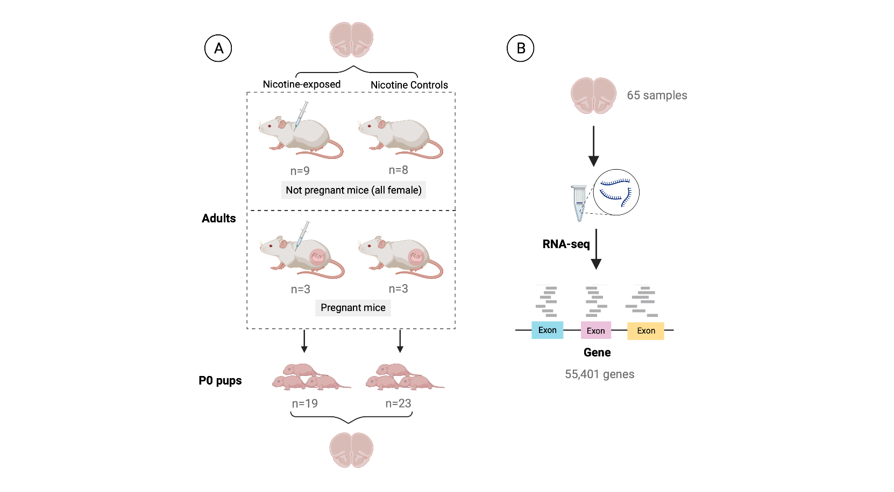
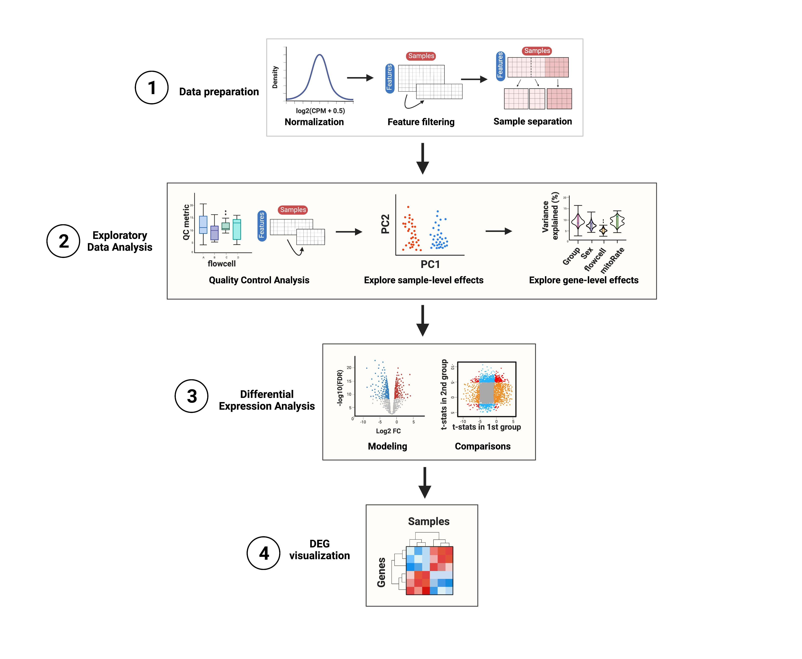

```{r, include = FALSE}
knitr::opts_chunk$set(
    collapse = TRUE,
    comment = "#>"
)
```

```{r vignetteSetup, echo=FALSE, message=FALSE, warning = FALSE}
## For links
library(BiocStyle)

## Track time spent on making the vignette
startTime <- Sys.time()

## Bib setup
library(RefManageR)

## For statistical data visualization
devtools::install_github('smin95/smplot2')

## Tools for the analysis of gene expression data
devtools::install_github("davismcc/scater")

## Write bibliography information
bib <- c(
    R = citation(),
    BiocStyle = citation("BiocStyle")[1],
    dplyr = citation("dplyr")[1],
    knitr = citation("knitr")[1],
    rmarkdown = citation("rmarkdown")[1],
    sessioninfo = citation("sessioninfo")[1],
    clusterProfiler = citation("clusterProfiler")[1],
    edgeR = citation("edgeR")[1],
    SPEAQeasy = citation("SPEAQeasyWorkshop2023")[2],
    smokingMouse = citation("smokingMouse")[1],
    here = citation("here")[1],
    jaffelab = citation("jaffelab")[1],
    limma = citation("limma")[1],
    ggplot2 = citation("ggplot2")[1],
    Hmisc = citation("Hmisc")[1],
    smplot2 = citation("smplot2")[1],
    stringr = citation("stringr")[1],
    cowplot = citation("cowplot")[1],
    org.Hs.eg.db = citation("org.Hs.eg.db")[1],
    pheatmap = citation("pheatmap")[1],
    rmarkdown = citation("rmarkdown")[1],
    RefManageR = citation("RefManageR")[1],
    SummarizedExperiment = citation("SummarizedExperiment")[1],
    scater = citation("scater")[1],
    rlang = citation("rlang")[1],
    ggrepel = citation("ggrepel")[1],
    voom = RefManageR::BibEntry(
        "article",
        key = "voom",
        author = "CW Law and Y Chen and W Shi and GK Smyth",
        year = "2014",
        title = "Voom: precision weights unlock linear model analysis tools for RNA-seq read counts",
        journal = "Genome Biology",
        volume = "15",
        pages = "R29"
    )
)
```

# Overview

**TODO**
This workshop aims to present the `SPEAQeasy` `r Citep(bib[["SPEAQeasy"]])` RNA-seq processing pipeline, demonstrating how its outputs can be used in Differential Expression Analyses (DEA) and the type of results it enables to obtain using other Bioconductor R packages such as `r Biocpkg('limma')`, `r Biocpkg('edgeR')`, and `r Biocpkg('clusterProfiler')`.

Briefly describe what is it , etc ... 


## Description

**TODO**
In this demo, participants will be able to understand what the pipeline does 
and what it returns through a Differential Expression Analysis performed on a SPEAQeasy 
dataset from the `smokingMouse` `r Citep(bib[["smokingMouse"]])` Bioconductor package 
which contains gene expression data and sample information from an RNA-sequencing 
experiment in mice. 


## Instructors

* [Daianna Gonzalez](https://daianna21.github.io)
* [Renee Garcia](https://reneegf.github.io)
* [Nick Eagles](https://nick-eagles.github.io)


## Pre-requisites

* General familiarity with bulk RNA-seq data.
* Basic knowledge of differential expression. 
* Basic experience handling `r Biocpkg('SummarizedExperiment')` and `r Biocpkg('GenomicRanges')` packages.
* Previous review of http://research.libd.org/smokingMouse/ for data explanation. (Optional)

## Participation

**TODO**
Participants are expected to follow 


## _R_ / _Bioconductor_ packages used

**TODO**
List any _R_ / _Bioconductor_ packages that will be explicitly covered.

## Time outline

**TODO**

| Activity                     | Time |
|------------------------------|------|
| Introduction to SPEAQeasy               | 15m |
| Data overview                           | 20m |
| Differential Expression Analysis        | 55m |

Total: a 90 minute session.


## Workshop goals and objectives

**TODO**
List "big picture" student-centered workshop goals and learning
objectives. Learning goals and objectives are related, but not the
same thing. These goals and objectives will help some people to decide
whether to attend the conference for training purposes, so please make
these as precise and accurate as possible.

*Learning goals* 
are high-level descriptions of what
participants will learn and be able to do after the workshop is
over. 
*Learning objectives*, on the other hand, describe in very
specific and measurable terms specific skills or knowledge
attained. The [Bloom's Taxonomy](#bloom) may be a useful framework
for defining and describing your goals and objectives, although there
are others.

### Learning goals

Some examples:

* describe how to...
* identify methods for...
* understand the difference between...

### Learning objectives

* analyze xyz data to produce...
* create xyz plots
* evaluate xyz data for artifacts


# Workshop

**TODO**
Divide the workshop into sections (`## A Section`). Include
fully-evaluated _R_ code chunks. Develop exercises and solutions, and
anticipate that your audience will walk through the code with you, or
work on the code idependently -- do not be too ambitious in the
material that you present.

## Introduction 

**TODO**

### SPEAQeasy Overview

**TODO**


## Data overview and download 

The dataset that will be used for the DEA can be downloaded from the `smokingMouse` package. 
Visit [here](http://research.libd.org/smokingMouse/) for more details of this package.



    <figcaption style="color: gray; line-height: 0.85; text-align: justify"><font size="-2"><b>Figure 1</b>: <b>Experimental design of the study. </b> The data was obtained from an experiment in which <b>A)</b> 6 pregnant dams and 17 non-pregnant female adult mice were administered nicotine by intraperitoneal injection (IP; n=12) or controls (n=11). A total of 42 pups were born to pregnant dams: 19 were born to mice that were administered nicotine and 23 to control mice. Samples from frontal cortices of P0 pups and adults were obtained. <b>B)</b> RNA was extracted from those samples and then RNA-seq libraries were prepared and sequenced to obtain the expression counts of the genes. At the end, a dataset of 65 samples (either from adult or pup brain) and 55,401 genes was generated. </font> 

   </figcaption>


The data reside in a `RangedSummarizedExperiment` (RSE) object, containing the following assays:

* `counts`: original read counts of the 55,401 mouse genes across 208 samples (inlcuding the 65 nicotine samples).
* `logcounts`: normalized and scaled counts ($log_2(CPM + 0.5)$) of the same genes across the same samples; normalization was carried out applying TMM method with `cpm(calcNormFactors())` of `r BiocStyle::Biocpkg("edgeR")`.


The same RSE contains the sample information in `colData(RSE)` and the gene information in `rowData(RSE)`.

<mark style= "background-color: #FCF3CF"> Yellow </mark> variables correspond to SPEAQeasy outputs that are going to be used in downstream analyses. 

<mark style= "background-color: #FAECF8"> Pink </mark> variables are specific of the study, such as sample metadata and some others containing additional information of the genes. 

<mark style= "background-color: #DFF0FE"> Blue </mark> variables are Quality-Control metrics computed by `addPerCellQC()` of `r BiocStyle::Biocpkg("scuttle")`.


### Gene Information 

Among the information in `rowData(RSE)` the next variables are of interest for the analysis:

* <mark style= "background-color: #FCF3CF"> <span style="font-family: monospace"> gencodeID</span> </mark>: GENCODE ID of each gene.
* <mark style= "background-color: #FCF3CF"> <span style="font-family: monospace"> ensemblID</span> </mark>: gene ID in Ensembl database.
* <mark style= "background-color: #FCF3CF"> <span style="font-family: monospace"> EntrezID</span> </mark>: identifier of each gene in NCBI Entrez database.
* <mark style= "background-color: #FCF3CF"> <span style="font-family: monospace"> Symbol</span> </mark>:  official gene symbol for each mouse gene.
* <mark style= "background-color: #FAECF8"> <span style="font-family: monospace"> retained_after_feature_filtering</span> </mark>: Boolean variable that equals TRUE if the gene passed the gene filtering (with `filterByExpr()` of `r BiocStyle::Biocpkg("edgeR")`) based on its expression levels and FALSE if not.

### Sample Information 

Sample information in `colData(RSE)` contains the following variables:

* <mark style= "background-color: #FCF3CF"> <span style="font-family: monospace"> SAMPLE_ID</span> </mark>: is the name of the sample.
* <mark style= "background-color: #FCF3CF"> <span style="font-family: monospace"> ERCCsumLogErr</span> </mark>: a summary statistic quantifying overall difference of expected and actual ERCC concentrations for one sample. 
* <mark style= "background-color: #FCF3CF"> <span style="font-family: monospace"> overallMapRate</span> </mark>: the decimal fraction of reads which successfully mapped to the reference genome (i.e. *numMapped* / *numReads*).
* <mark style= "background-color: #FCF3CF"> <span style="font-family: monospace"> mitoMapped</span> </mark>: the number of reads which successfully mapped to the mitochondrial chromosome.
* <mark style= "background-color: #FCF3CF"> <span style="font-family: monospace"> totalMapped</span> </mark>: the number of reads which successfully mapped to the canonical sequences in the reference genome (excluding mitochondrial chromosomes).
* <mark style= "background-color: #FCF3CF"> <span style="font-family: monospace"> mitoRate</span> </mark>: the decimal fraction of reads which mapped to the mitochondrial chromosome, of those which map at all (i.e. *mitoMapped* / (*totalMapped* + *mitoMapped*))
* <mark style= "background-color: #FCF3CF"> <span style="font-family: monospace"> totalAssignedGene</span> </mark>: the decimal fraction of reads assigned unambiguously to a gene (including mitochondrial genes), with `featureCounts` (Liao et al. 2014), of those in total.
* <mark style= "background-color: #FCF3CF"> <span style="font-family: monospace"> rRNA_rate</span> </mark>: the decimal fraction of reads assigned to a gene whose type is ‘rRNA’, of those assigned to any gene.
* <mark style= "background-color: #FAECF8"> <span style="font-family: monospace"> Tissue</span> </mark>: tissue (mouse brain or blood) from which the sample comes.
* <mark style= "background-color: #FAECF8"> <span style="font-family: monospace"> Age</span> </mark>: if the sample comes from an adult or a pup mouse.
* <mark style= "background-color: #FAECF8"> <span style="font-family: monospace"> Sex</span> </mark>: if the sample comes from a female (F) or male (M)  mouse.
* <mark style= "background-color: #FAECF8"> <span style="font-family: monospace"> Expt</span> </mark>:  the experiment (nicotine or smoking exposure) to which the sample mouse was subjected; it could be an exposed or a control mouse of that experiment.
* <mark style= "background-color: #FAECF8"> <span style="font-family: monospace"> Group</span> </mark>: if the sample belongs to a nicotine/smoking-exposed mouse (Expt) or a nicotine/smoking control mouse (Ctrl).
* <mark style= "background-color: #FAECF8"> <span style="font-family: monospace"> plate</span> </mark>: is the plate (1,2 or 3) in which the sample library was prepared.
* <mark style= "background-color: #FAECF8"> <span style="font-family: monospace"> Pregnancy</span> </mark>:  if the sample comes from a pregnant (Yes) or not pregnant (No) mouse.
* <mark style= "background-color: #FAECF8"> <span style="font-family: monospace"> medium</span> </mark>: is the medium in which the sample was treated: water for brain samples and an elution buffer (EB) for the blood ones.
* <mark style= "background-color: #FAECF8"> <span style="font-family: monospace"> flowcell</span> </mark>: is the sequencing batch of each sample.
* <mark style= "background-color: #DFF0FE"> <span style="font-family: monospace"> sum</span> </mark>: library size (total sum of counts across all genes for each sample).
* <mark style= "background-color: #DFF0FE"> <span style="font-family: monospace"> detected</span> </mark>: number of non-zero expressed genes in each sample.
* <mark style= "background-color: #DFF0FE"> <span style="font-family: monospace"> subsets_Mito_sum</span> </mark>: total sum of read counts of mt genes in each sample.
* <mark style= "background-color: #DFF0FE"> <span style="font-family: monospace"> subsets_Mito_detected</span> </mark>: total number of mt genes in each sample.
* <mark style= "background-color: #DFF0FE"> <span style="font-family: monospace"> subsets_Mito_percent</span> </mark>: % of mt genes' counts of the total counts of the sample. 
* <mark style= "background-color: #DFF0FE"> <span style="font-family: monospace"> subsets_Ribo_sum</span> </mark>: total sum of read counts of ribosomal genes in each sample.
* <mark style= "background-color: #DFF0FE"> <span style="font-family: monospace"> subsets_Ribo_detected</span> </mark>: total number of ribosomal genes in each sample.
* <mark style= "background-color: #DFF0FE"> <span style="font-family: monospace"> subsets_Ribo_percent</span> </mark>: % of ribosomal genes' counts of the total counts of the sample.

<div class="alert alert-info">
  <strong>Note:</strong> in our case, we'll use samples from the nicotine experiment only, so all samples come from brain and were treated in water.
</div>

```{r "examine_outputs"}

library(here)
library(SummarizedExperiment)
library(smokingMouse)


################################
#         Retrive data
################################
# Provisional data source until smokingMouse pkg is accepted
load(here('provisional_data/rse_gene_mouse_RNAseq_nic-smo.Rdata'), verbose=TRUE)
## Explore complete rse_gene object (including smoking-exposed samples as well)
rse_gene

#################################
##   Extract data of interest
#################################
## Keep samples from nicotine experiment only
rse_gene_nic <- rse_gene[,which(rse_gene$Expt=='Nicotine')]
## New dimensions
dim(rse_gene_nic)

#################################
##  Access gene expression data
#################################

## Raw counts for first 3 genes in the first 5 samples
assays(rse_gene_nic)$counts[1:3,1:5]
## Log-normalized counts for first 3 genes in the first 5 samples
assays(rse_gene_nic)$logcounts[1:3,1:5]

#################################
##     Access sample data
#################################

## Info for the first 2 samples
head(colData(rse_gene_nic), 2)

```

## Differential Expression Analysis

In this workshop we'll guide you through a Differential Expression Analysis following the steps presented in **Figure 2**. The main objective is to determine which genes are affected by nicotine administration (in adults) or exposure (in pups) in mouse brain. 

<figure>
    
        <figcaption style="color: gray; line-height: 0.87; text-align: justify">
            <font size="-1.8">
                <b>Figure 2</b>: <b> Summary of the analyses. </b> Steps in yellow will be properly performed. 
                <b> 1. Data Preparation </b> 
                <b> 2. Exploratory Data Analysis </b> 
                <b> 3. Differential Expression Analysis </b> 
                <b> 4. GO & KEGG Analyses  </b> 
                <b> 5. DEG visualization  </b> </font> 
            <font size="0.8"> Abbreviations: CPM: counts per million; QC: quality control; PC: principal component; 
            DEG: differentially expressed genes; GO: Gene Ontology; KEGG: Kyoto Encyclopedia of Genes and Genomes.</font>
        </figcaption>
</figure>

### 1. Data preparation {-}
Even before exploring the samples, the first step is to normalize the counts and filter non-expressed genes; we won't do the processes themselves since we already have normalized and filtered data but let's check why these steps are important and where to extract the data we need for posterior analyses.  

**1.1 Data normalization**

Data normalization is a primordial step when working with expression data because raw counts do not necessarily reflect real expression measures of the genes since there are technical differences in the way the libraries are prepared and sequenced, as well as intrinsic differences in the genes that are translated into more or less mapping reads. Particularly, there are *within-sample effects* that are the differences between genes in the same sample, such as their **length** (the longer the gene, the more reads it will have) and **GC content**, factors that contribute to variations in their counts. On the other hand, *between-sample effects* are differences between samples such as the **sequencing depth**, i.e., the total number of molecules sequenced, and the **library size**, i.e., the total number of reads of each sample [1].

These variables lead to virtually different mRNA amounts but of course are not due to the biological or treatment conditions of interest (such as nicotine administration in this example) so in order to remove, or at least, to minimize this technical bias and obtain measures comparable and consistent across samples, raw counts must be normalized by these factors. The data that we'll use in this case are already normalized in `assays(rse_gene)$logcounts`. Specifically, the assay contains counts per million (CPM), also known as reads per million (RPM), one basic gene expression unit that only normalizes by the sequencing depth and is computed by dividing the read counts of a gene in a sample by a scaling factor given by the total mapping reads of the sample per million [2]:

$$CPM = \frac{read \ \ counts \ \ of \ \ gene \ \ \times \ \ 10^6 }{Total \ \ mapping \ \ reads \ \ of \ \ sample}$$ 


As outlined in [**Data overview and download**](##Data overview and download), the scaling factors were obtained with `calcNormFactors()` applying the Trimmed Mean of M-Values (TMM) method, the `r BiocStyle::Biocpkg("edgeR")` package's default normalization method that assumes that most genes are not differentially expressed. The effective library sizes of the samples and the CPM of each observation were computed with the `r BiocStyle::Biocpkg("edgeR")` function `cpm()` setting the `log` argument to `TRUE` and `prior.count` to 0.5 to receive values in $log_2(CPM+0.5)$.

After data normalization and scaling, we’d expect the read counts to follow a Norm distribution, something we can confirm comparing the counts' distribution before and after the normalization. Consider both datasets contain the exact same genes. 

```{r "Data preparation", message=FALSE, warning=FALSE}

library(ggplot2)

## Histogram and density plot of read counts before and after normalization 

## Raw counts
counts_data <- data.frame(counts=as.vector(assays(rse_gene_nic)$counts))
plot <- ggplot(counts_data, aes(x=counts)) +
    geom_histogram(colour="black", fill="lightgray") +
    labs(x='read counts', y='Frecuency') +
    theme_classic() +
    theme(plot.margin = unit(c(0.5,1,0.2,1), "cm")) 
plot

## Normalized counts
logcounts_data <- data.frame(logcounts=as.vector(assays(rse_gene_nic)$logcounts))
plot <- ggplot(logcounts_data, aes(x=logcounts)) +
    geom_histogram(aes(y=..density..), colour="darkgray", fill="lightgray") +
    theme_classic() +
    geom_density(fill="#69b3a2", alpha=0.3) +
    labs(x='log(CPM+0.5)', y='Frecuency') +
    theme(plot.margin = unit(c(0.5,1,0.2,1), "cm")) 
plot

```

As presented, after data transformation, we can now see a more widespread distribution of the counts, but note that most of them are zeros in the first plot (the one with the raw counts) and those zeros remain after normalization, corresponding to counts below 0 in the second plot. That is because we haven't filtered the low and zero-expressed genes. 


**1.2 Gene filtering**

Low-expressed or non-expressed genes in many samples are not of biological interest in a study of differential expression because they don't inform about the gene expression changes and they are, by definition, not differentially expressed, so we have to drop them using `filterByExpr()` from `r BiocStyle::Biocpkg("edgeR")` that only keeps genes with at least *K* CPM in *n* samples and with a minimum total number of counts across all samples.

```{r,  message=FALSE, warning=FALSE}

## Retain genes that passed filtering step
rse_gene_filt <- rse_gene_nic[rowData(rse_gene_nic)$retained_after_feature_filtering==TRUE,]

## Normalized counts and filtered genes
filt_logcounts_data <- data.frame(logcounts=as.vector(assays(rse_gene_filt)$logcounts))

## Plot
plot <- ggplot(filt_logcounts_data, aes(x=logcounts)) +
    geom_histogram(aes(y=..density..), colour="darkgray", fill="lightgray") +
    theme_classic() +
    geom_density(fill="#69b3a2", alpha=0.3) +
    labs(x='log(CPM+0.5)', y='Frecuency') +
    theme(plot.margin = unit(c(0.5,1,0.2,1), "cm")) 
plot


```

In this third plot we can observe a curve that is closer (though not completely) to a Norm distribution and with less low-expressed genes. 

With the object `rse_gene_filt` we can proceed with downstream analyses. 


### 2. Exploratory Data Analysis {-}
The first formal step that we will be performing is the sample exploration. This crucial initial part of the analysis consists of an examination of differences and relationships between Quality-Control (QC) metrics of the samples from different groups in order to identify poor-quality samples that must be removed before DEA. After that, we will evaluate the similarities and grouping (not clustering) of the samples by their gene expression variation through a Dimensionality Reduction analysis. Finally, the sample variables in the meta-data also need to be analyzed and filtered based on the percentage of gene expression variance that they explain for each gene. 


**2.1 Quality Control Analysis**

First we have to explore and compare the the quality-control metrics of the samples in the different groups given by covariates such as age, sex, pregnancy state, group, plate and flowcell. See [**Sample Information**](###Sample Information) for the description of the variables.  

<style>
p.comment {
background-color: #DBDBDB;
padding: 10px;
border: 1px solid black;
margin-left: 25px;
border-radius: 5px;
font-style: italic;
}

</style>

<p class="comment">
***Why is that relevant?*** As you could imagine, technical and methodological differences in all the steps that were carried out during the experimental stages are potential sources of variation in the quality of the samples. Just imagine all that could have been gone wrong or unexpected while experimenting with mice, during the sampling, in the RNA extraction using different batches, when treating samples in different mediums, when preparing libraries in different plates and sequencing in different flowcells. Moreover, the inherent features of the mice from which the samples come from such as age, tissue, sex and pregnancy state could also affect the samples' metrics if, for example, they were separately analyzed and processed. 
</p>


<p class="comment">
***But why do we care about mitochodrial and ribosomal counts as QC metrics?*** In the process of mRNA extraction, either by mRNA enrichment (capturing polyadenilated mRNAs) or rRNA-depletion (removing rRNA), we’d expect to have a low number of ribosomal counts, i.e., counts that map to rDNA, and if we don’t, something must have gone wrong with the procedures. In the case of mitochondrial counts something similar occurs: higher mitochondrial rates will be obtained if the cytoplasmic mRNA capture was deficient or if the transcripts were lost by some technical issue, increasing the proportion of mitochondrial mRNAs. As a result, high <mark style= "background-color: #FCF3CF"> <span style="font-family: monospace"> mitoRate</span> </mark> and <mark style= "background-color: #FCF3CF"> <span style="font-family: monospace"> rRNA_rate</span> </mark> imply poor quality in the samples.
</p>


<div class="alert alert-info">
  <strong>Note:</strong> the QC metrics were computed with the unprocessed datasets (neither filtered nor normalized) to preserve the original estimates of the samples.
</div>


*2.1.1 Evaluate QC metrics for groups of samples*

Fortunately, we can identify to some extent possible factors that could have influenced on the quality of the samples, as well as isolated samples that are problematic. To do that, we will create boxplots that present the distribution of the samples' metrics separating them by sample variables. 

```{r "QC_boxplots",  message=FALSE, warning=FALSE}
library(Hmisc)
library(smplot2)
library(stringr)
library(cowplot)

## Define QC metrics of interest
qc_metrics <- c('mitoRate', 'overallMapRate', 'totalAssignedGene', 'rRNA_rate', 'sum', 'detected', 'ERCCsumLogErr')

## Define sample variables of interest
sample_variables <- c('Group', 'Age', 'Sex', 'Pregnancy', 'plate', 'flowcell')


## Function to create boxplots of QC metrics for groups of samples

QC_boxplots <- function(qc_metric, sample_var){
    
    ## Define sample colors depending on the sample variable
    if (sample_var=="Group"){
        colors=c('Control'='brown2', 'Experimental'='deepskyblue3')
    }
    else if (sample_var=="Age"){
        colors=c('Adult'='slateblue3', 'Pup'='yellow3')
    }
    else if (sample_var=="Sex"){
        colors=c('F'='hotpink1', 'M'='dodgerblue')
    }
    else if (sample_var=='Pregnancy'){
        colors=c('Yes'='darkorchid3', 'No'='darkolivegreen4')
    }
    else if (sample_var=='plate'){
        colors=c('Plate1'='darkorange', 'Plate2'='lightskyblue', 'Plate3'='deeppink1')
    }
    else if (sample_var=='flowcell'){
        colors=c('HKCG7DSXX'='chartreuse2','HKCMHDSXX'='magenta', 'HKCNKDSXX'='turquoise3', 
                 'HKCTMDSXX'='tomato')
    }
    
    ## Axis labels
    x_label=capitalize(sample_var)
    y_label=str_replace_all(qc_metric, c("_"=""))
    
    ## x-axis text angle and position
    if (sample_var=='flowcell'){
        x_axis_angle = 18
        x_axis_hjust = 0.5
        x_axis_vjust = 0.7
        x_axis_size = 4
    }
    else {
        x_axis_angle = 0
        x_axis_hjust = 0.5
        x_axis_vjust = 0.5
        x_axis_size = 6
    }
    
    ## Extract sample data in colData(rse_gene_filt)
    data <- data.frame(colData(rse_gene_filt))
    
    ## Sample variable separating samples in x-axis and QC metric in y-axis
    ## (Coloring by sample variable)
    plot <- ggplot(data = data, mapping = aes(x = !! rlang::sym(sample_var), y = !! rlang::sym(qc_metric), color = !! rlang::sym(sample_var))) +
                ## Add violin plots
                geom_violin(alpha = 0, size = 0.4, color='black', width=0.7)+
                ## Spread dots
                geom_jitter(width = 0.08, alpha = 0.7, size = 1.3) +
                ## Add boxplots
                geom_boxplot(alpha = 0, size = 0.4, width=0.1, color='black') +
                ## Set colors
                scale_color_manual(values = colors) +
                ## Hide legend
                sm_hgrid() +
                ## Define axis labels
                labs(y= y_label, x = x_label) +
                ## Define plot margins and size of axis title and text
                theme(plot.margin = unit(c(0.5,0.4,0.5,0.4), "cm"),
                      axis.title = element_text(size = 7),
                      axis.text = element_text(size = x_axis_size),
                      axis.text.x = element_text(angle = x_axis_angle, hjust = x_axis_hjust, vjust = x_axis_vjust))

    return(plot)
}


## Plots of all QC metrics for each sample variable
multiple_QC_boxplots <- function(sample_var){
    
    i=1
    plots = list()
    for (qc_metric in qc_metrics) {
        ## Call function to create each individual plot
        plots[[i]]<- QC_boxplots(qc_metric, sample_var)
        i=i+1
    }
    ## Arrange multiple plots into a grid
    print(plot_grid(plots[[1]], plots[[2]], plots[[3]], plots[[4]], plots[[5]], plots[[6]], plots[[7]], nrow = 2))
}

```


```{r message=FALSE, warning=FALSE}
multiple_QC_boxplots('Age')
```

Initially, when we separate samples by Age, we can appreciate a clear segregation of adult and pup samples in <mark style= "background-color: #FCF3CF"> <span style="font-family: monospace"> mitoRate</span> </mark>, with higher mitochondrial rates for adult samples and thus, being lower quality samples than the pup ones. We can also see that pup samples have higher <mark style= "background-color: #FCF3CF"> <span style="font-family: monospace"> totalAssignedGene</span> </mark>, again being higher quality. The samples are very similar in the rest of the QC metrics.
The former differences must be taken into account because they guide further sample separation by Age, which is necessary to avoid dropping most of the adult samples (that are lower quality) in the **QC-based sample filtering** (see below) and to prevent misinterpreting sample variation given by quality and not by mice age itself. 

```{r message=FALSE, warning=FALSE}
multiple_QC_boxplots('Sex')
```

With Sex, female and male samples have similar QC metrics but there are some female samples that have high <mark style= "background-color: #FCF3CF"> <span style="font-family: monospace"> mitoRate</span> </mark> and low <mark style= "background-color: #FCF3CF"> <span style="font-family: monospace"> totalAssignedGene</span> </mark>, but males don´t. That is consistent with the fact that all males are pups and as we previously observed, pup samples present better QC metrics, but since not all pups are males, some female pups also have smaller <mark style= "background-color: #FCF3CF"> <span style="font-family: monospace"> mitoRate</span> </mark> and greater <mark style= "background-color: #FCF3CF"> <span style="font-family: monospace"> totalAssignedGene</span> </mark>. So in this case samples' differences are actually dictated by Age and not by Sex.


```{r message=FALSE, warning=FALSE}
multiple_QC_boxplots('Group')
```

Notably, for Group no evident contrasts are seen in the quality of the samples, which means that both, control and exposed samples have similar metrics and therefore, the differences between them won't be determined by technical factors but effectively by gene expression changes. 

```{r message=FALSE, warning=FALSE}
multiple_QC_boxplots('Pregnancy')
```

Pregnancy variable is interesting because pregnant dams were obviously females and adults, which we already noted are lower quality. Accordingly to that, pregnant samples present overall higher <mark style= "background-color: #FCF3CF"> <span style="font-family: monospace"> mitoRate</span> </mark>, lower <mark style= "background-color: #FCF3CF"> <span style="font-family: monospace"> totalAssignedGene</span> </mark>, <mark style= "background-color: #DFF0FE"> <span style="font-family: monospace"> sum</span> </mark> (library size) and <mark style= "background-color: #DFF0FE"> <span style="font-family: monospace"> detected </span> </mark> (number of expressed genes) than some samples coming from non-pregnant mice. However, these samples have smaller |<mark style= "background-color: #FCF3CF"> <span style="font-family: monospace"> ERCCsumLogErr</span> </mark>|, which means that they had smaller differences between expected and observed concentrations of control transcripts. 

Notwithstanding, we must clarify one more time that as in Sex, the trends observed in Pregnancy are all given by Age: it is Age the variable that fully segregates samples in <mark style= "background-color: #FCF3CF"> <span style="font-family: monospace"> mitoRate</span> </mark> and almost completely in </mark>, lower <mark style= "background-color: #FCF3CF"> <span style="font-family: monospace"> totalAssignedGene</span> </mark>. Because all pregnant dams were adults, their metrics will be positioned where the adult samples did, but there were also not pregnant adults that share similar QC values. 


```{r message=FALSE, warning=FALSE}
multiple_QC_boxplots('plate')
```

In plate, no alarming differences are presented but some samples from the 1st plate
have low (though not much lower) <mark style= "background-color: #FCF3CF"> <span style="font-family: monospace"> overallMapRate</span> </mark>, </mark>, as well as smaller <mark style= "background-color: #FCF3CF"> <span style="font-family: monospace"> totalAssignedGene</span> </mark> and <mark style= "background-color: #DFF0FE"> <span style="font-family: monospace"> sum</span> </mark>. 

```{r message=FALSE, warning=FALSE}
multiple_QC_boxplots('flowcell')
```

For the flowcell, again not worrying distinctiveness are obtained, with the exception of a few individual samples far from the rest. 

In all the previous plots we can appreciate a group of samples placed below in <mark style= "background-color: #FCF3CF"> <span style="font-family: monospace"> mitoRate</span> </mark> that correspond to pup samples. The relationship is more fuzzy in <mark style= "background-color: #FCF3CF"> <span style="font-family: monospace"> totalAssignedGene</span> </mark>.


*2.1.2 Examine relationships between QC metrics of samples*
Secondly, we want to analyze if there are relationships between QC variables that explain the presence of samples with two or more particular QC metrics. For that, scatterplots are useful because they enable the evaluation of pairs of samples' QC metrics. 

```{r "QC scatterplots", message=FALSE, warning=FALSE}

## Scatterplots for a pair of QC metrics

QC_scatterplots <- function(sample_var, qc_metric1, qc_metric2){

    ## Define sample colors
    if (sample_var=="Group"){
        colors=c('Control'='brown2', 'Experimental'='deepskyblue3')
    }
    else if (sample_var=="Age"){
        colors=c('Adult'='slateblue3', 'Pup'='yellow3')
    }
    else if (sample_var=="Sex"){
        colors=c('F'='hotpink1', 'M'='dodgerblue')
    }
    else if (sample_var=='Pregnancy'){
        colors=c('Yes'='darkorchid3', 'No'='darkolivegreen4')
    }
    else if (sample_var=='plate'){
        colors=c('Plate1'='darkorange', 'Plate2'='lightskyblue', 'Plate3'='deeppink1')
    }
    else if (sample_var=='flowcell'){
        colors=c('HKCG7DSXX'='chartreuse2','HKCMHDSXX'='magenta', 'HKCNKDSXX'='turquoise3', 
                 'HKCTMDSXX'='tomato')
    }

    data <- colData(rse_gene_filt)

    ## Scatterplots for continuous variable vs continuous variable
    ## First QC metric in x-axis and second QC metric in y-axis
    plot <- ggplot(as.data.frame(data), aes(x=!! rlang::sym(qc_metric1),
                                            y=!! rlang::sym(qc_metric2),
                                            ## Color samples by a variable
                                           color=!! rlang::sym(sample_var))) +
        ## Add scatterplot
        geom_point(size=1) +
        ## Add regression line
        stat_smooth (geom="line", alpha=0.4, size=0.4, span=0.25, method = lm, color='orangered3') +
        ## Colors
        scale_color_manual(name = sample_var, values = colors) +
        theme_bw() +
        ## Add Pearson correlation coefficient between the metrics as subtitle
        labs(subtitle = paste0("Corr: ", signif(cor(data[,qc_metric1], data[,qc_metric2], method = "pearson"), digits=3)), 
             ## Add axis labels
             y= gsub('_', ' ', qc_metric2), 
             x = gsub('_', ' ', qc_metric1)) +
        ## Plot margins and text size
        theme(plot.margin=unit (c (0.4,0.1,0.4,0.1), 'cm'),
              axis.title = element_text(size = (7)),
              axis.text = element_text(size = (6)),
              plot.subtitle = element_text(size = 7, color='gray40'),
              legend.text = element_text(size=6),
              legend.title = element_text(size=7))
    return(plot)
    
}


## QC scatterplots coloring by all sample variables
multiple_QC_scatterplots <- function(qc_metric1, qc_metric2){
    
    sample_variables <- c('Age', 'Sex', 'Group', 'plate', 'Pregnancy', 'flowcell')
    
    i=1
    plots = list()
    for (sample_var in sample_variables) {
        plots[[i]]<- QC_scatterplots(sample_var, qc_metric1, qc_metric2)
        i=i+1
    }
    print(plot_grid(plots[[1]], plots[[2]], plots[[3]], plots[[4]], plots[[5]], plots[[6]], nrow = 2, rel_widths = c(1.1,1,1.2) ))
}


```

```{r message=FALSE, warning=FALSE}
multiple_QC_scatterplots('mitoRate', 'rRNA_rate')
```

For <mark style= "background-color: #FCF3CF"> <span style="font-family: monospace"> mitoRate</span> </mark> vs <mark style= "background-color: #FCF3CF"> <span style="font-family: monospace"> rRNA_rate</span> </mark> plots there's a poor positive correlation which was anticipated since no obvious relationship exists between them, though if cytoplasmic mRNAs wouldn’t have been well captured (lowering the total number of mapping reads) we could expect an increase in both mitochondrial and ribosomal rates. 

Note the complete separation of samples in <mark style= "background-color: #FCF3CF"> <span style="font-family: monospace"> mitoRate</span> </mark> (but not in <mark style= "background-color: #FCF3CF"> <span style="font-family: monospace"> rRNA_rate</span> </mark>) by Age, which in turn causes the grouping of male samples (all pups). 


```{r message=FALSE, warning=FALSE}
multiple_QC_scatterplots('mitoRate', 'totalAssignedGene')
```

Surprisingly, <mark style= "background-color: #FCF3CF"> <span style="font-family: monospace"> mitoRate</span> </mark>  and <mark style= "background-color: #FCF3CF"> <span style="font-family: monospace"> totalAssignedGene</span> </mark> have a strong negative correlation. Since <mark style= "background-color: #FCF3CF"> <span style="font-family: monospace"> totalAssignedGene</span> </mark> includes mitochondrial genes' counts
Again, observe pup segregation. 
?????????????????????????????????????????????????????????????

```{r message=FALSE, warning=FALSE}
multiple_QC_scatterplots('sum', 'detected')
```
Noticeably, a positive correlation is present for <mark style= "background-color: #DFF0FE"> <span style="font-family: monospace"> sum</span> </mark> and <mark style= "background-color: #DFF0FE"> <span style="font-family: monospace"> detected</span> </mark> and that is also congruent because a higher number of expressed-genes implies bigger library sizes, but that is not necessarily true in the other way around: just a few highly expressed genes (small number of <mark style= "background-color: #DFF0FE"> <span style="font-family: monospace"> detected</span> </mark> genes) could increase the library size. Interestingly, in this case samples are diagonally separated by age. 


```{r message=FALSE, warning=FALSE}
multiple_QC_scatterplots('sum', 'totalAssignedGene')
```

Contrary to expectations, <mark style= "background-color: #DFF0FE"> <span style="font-family: monospace"> sum</span> </mark> is not correlated to <mark style= "background-color: #FCF3CF"> <span style="font-family: monospace"> totalAssignedGene</span> </mark> and it is unexpected because higher proportions of genes' reads could initially increase library size. However, since <mark style= "background-color: #FCF3CF"> <span style="font-family: monospace"> totalAssignedGene</span> </mark> is a fraction of the total reads, it could be that a high fraction of reads mapping to genes reflects a small number of total reads and do not necessarily implies more expressed genes (and therefore bigger libraries). In other words, even when <mark style= "background-color: #FCF3CF"> <span style="font-family: monospace"> totalAssignedGene</span> </mark> equals 1, if the total number of genes is small, the genes won't be widely covered by reads and the libraries won't be sizeable. 


```{r message=FALSE, warning=FALSE}
multiple_QC_scatterplots('detected', 'totalAssignedGene')
```

Lastly, there's a positive correlation between <mark style= "background-color: #FCF3CF"> <span style="font-family: monospace"> totalAssignedGene</span> </mark> and <mark style= "background-color: #DFF0FE"> <span style="font-family: monospace"> detected</span> </mark>, which makes sense because reads assigned to genes rise the number of non-zero expressed genes but as mentioned, those genes are not necessarily highly expressed and thus, library sizes are not perforce so much bigger. Also note that the correlation wouldn't be conserved within pup samples. 


Remarkably, samples were not differentiated by any other variable (including Group!) but the differences between adult and pup metrics suggest that they must be splitted into two different groups for the following analyses.


*2.1.3 QC sample filtering*

After assessing how different or similar are the QC values between samples, we can now proceed to sample filtering based, precisely, on these metrics. For that, we will use `isOutlier()` from `r BiocStyle::Biocpkg("scater")` to identify outlier samples only at the lower end ("lower") or the higher end ("higher"), depending on the QC metric.

```{r "QC sample filtering", message=FALSE, warning=FALSE}

library(scater)
library(rlang)
library(ggrepel)

## Separate data by Age
rse_gene_pups<- rse_gene_filt[,which(rse_gene_filt$Age=="Pup")]
rse_gene_adults <- rse_gene_filt[,which(rse_gene_filt$Age=="Adult")]


## Find outlier samples based on their QC metrics (samples that are 3 median-absolute-deviations away from the median)


## Filter all samples together

## Drop samples with lower library sizes (sum), detected number of genes and totalAssignedGene 
outliers_library_size <- isOutlier(rse_gene_filt$sum, nmads = 3, type="lower")
outliers_detected_num <- isOutlier(rse_gene_filt$detected, nmads = 3, type="lower")
outliers_totalAssignedGene <- isOutlier(rse_gene_filt$totalAssignedGene, nmads = 3, type="lower")
## Drop samples with higher mitoRates and rRNA rates 
outliers_mito<-isOutlier(rse_gene_filt$mitoRate, nmads = 3, type="higher")
outliers_rRNArate <- isOutlier(rse_gene_filt$rRNA_rate, nmads = 3, type="higher")

## Keep not outlier samples
not_outliers<-which(! (outliers_library_size | outliers_detected_num | outliers_totalAssignedGene | outliers_mito | outliers_rRNArate))
rse_gene_qc<-rse_gene_filt[,not_outliers]

## Number of samples retained
dim(rse_gene_qc)[2]

## Add new variables to rse_gene_filt with info of samples retained/dropped
rse_gene_filt$Retention_after_QC_filtering <- as.vector(sapply(rse_gene_filt$SAMPLE_ID, function(x){if (x %in% rse_gene_qc$SAMPLE_ID){'Retained'} else{'Dropped'}}))


## Filter adult samples

outliers_library_size <- isOutlier(rse_gene_adults$sum, nmads = 3, type="lower")
outliers_detected_num <- isOutlier(rse_gene_adults$detected, nmads = 3, type="lower")
outliers_totalAssignedGene <- isOutlier(rse_gene_adults$totalAssignedGene, nmads = 3, type="lower")
outliers_mito<-isOutlier(rse_gene_adults$mitoRate, nmads = 3, type="higher")
outliers_rRNArate <- isOutlier(rse_gene_adults$rRNA_rate, nmads = 3, type="higher")

not_outliers<-which(! (outliers_library_size | outliers_detected_num | outliers_totalAssignedGene | outliers_mito | outliers_rRNArate))
rse_gene_adults_qc<-rse_gene_adults[,not_outliers]

## Number of samples retained
dim(rse_gene_adults_qc)[2]

rse_gene_adults$Retention_after_QC_filtering <- as.vector(sapply(rse_gene_adults$SAMPLE_ID, function(x){if (x %in% rse_gene_adults_qc$SAMPLE_ID){'Retained'} else{'Dropped'}}))


## Filter pup samples

outliers_library_size <- isOutlier(rse_gene_pups$sum, nmads = 3, type="lower")
outliers_detected_num <- isOutlier(rse_gene_pups$detected, nmads = 3, type="lower")
outliers_totalAssignedGene <- isOutlier(rse_gene_pups$totalAssignedGene, nmads = 3, type="lower")
outliers_mito<-isOutlier(rse_gene_pups$mitoRate, nmads = 3, type="higher")
outliers_rRNArate <- isOutlier(rse_gene_pups$rRNA_rate, nmads = 3, type="higher")

not_outliers<-which(! (outliers_library_size | outliers_detected_num | outliers_totalAssignedGene | outliers_mito | outliers_rRNArate))
rse_gene_pups_qc<-rse_gene_pups[,not_outliers]

## Number of samples retained
dim(rse_gene_pups_qc)[2]

rse_gene_pups$Retention_after_QC_filtering <- as.vector(sapply(rse_gene_pups$SAMPLE_ID, function(x){if (x %in% rse_gene_pups_qc$SAMPLE_ID){'Retained'} else{'Dropped'}}))


```

We already filtered outlier samples ... but what have we removed?
It is always important to trace the QC metrics of the filtered samples to verify that they really are poor-quality. We don't want to get rid of useful samples! So lets go back to the QC boxplots but now coloring samples according to whether they passed or not the filtering and also distinguishing samples' groups by shape. 

```{r message=FALSE, warning=FALSE}

## Boxplots of QC metrics after sample filtering

## Boxplots
boxplots_after_QC_filtering <- function(RSE, qc_metric, sample_var){

    rse_gene<-eval(parse_expr(RSE))
    
    ## Color samples 
    colors=c('Retained'='deepskyblue', 'Dropped'='brown2')

    ## Sample shape by sample variables 
    if (sample_var=="Group"){
        shapes=c('Control'=0, 'Experimental'=15)
    }
    else if (sample_var=="Age"){
        shapes=c('Adult'=16, 'Pup'=1)
    }
    else if (sample_var=="Sex"){
        shapes=c('F'=11, 'M'=19)
    }
    else if (sample_var=='Pregnancy'){
        shapes=c('Yes'=10, 'No'=1)
    }
    else if (sample_var=='plate'){
        shapes=c('Plate1'=12, 'Plate2'=5, 'Plate3'=4)
    }
    else if (sample_var=='flowcell'){
        shapes=c('HKCG7DSXX'=3,'HKCMHDSXX'=8, 'HKCNKDSXX'=14, 
                 'HKCTMDSXX'=17)
    }


    y_label=str_replace_all(qc_metric, c("_"=" "))
    
    data <- data.frame(colData(rse_gene))

    ## Median of the QC var values
    median<-median(eval(parse_expr(paste("rse_gene$", qc_metric, sep=""))))
    ## Median-absolute-deviation of the QC var values
    mad<-mad(eval(parse_expr(paste("rse_gene$", qc_metric, sep=""))))

    plot <- ggplot(data = data, mapping = aes(x = '', y = !! rlang::sym(qc_metric), 
                                              color = !! rlang::sym('Retention_after_QC_filtering'))) +
        geom_jitter(alpha = 1, size = 2, aes(shape=eval(parse_expr((sample_var))))) +
        geom_boxplot(alpha = 0, size = 0.15, color='black') +
        scale_color_manual(values = colors) +
        scale_shape_manual(values = shapes) +
        labs(x="", y = y_label, color='Retention after QC filtering', shape=sample_var) +
        sm_hgrid() +
        theme_classic() +
        ## Median line
        geom_hline(yintercept = median, size=0.5) +
        ## Line of median + 3 MADs
        geom_hline(yintercept = median+(3*mad), size=0.5, linetype=2) +
        ## Line of median - 3 MADs
        geom_hline(yintercept = median-(3*mad), size=0.5, linetype=2) +
        theme(plot.margin=unit (c (1,3,1,3), 'cm'),
              axis.title = element_text(size = (9)),
              axis.text = element_text(size = (8)),
              legend.position="right",
              legend.text = element_text(size=8),
              legend.title = element_text(size=9))

    return(plot)
}


```

In the following plot we can confirm that taking all samples together (both adult and pup samples) all adult samples are dropped by their high <mark style= "background-color: #FCF3CF"> <span style="font-family: monospace"> mitoRates</span> </mark>, but that is not desirable because we want to analyze these samples too, so we need to analyze pup and adult samples separately. 

```{r message=FALSE, warning=FALSE}

## Plots

## All samples together
boxplots_after_QC_filtering('rse_gene_filt', 'mitoRate', 'Age')

```
For adults, only 3 controls are dropped, 3 of them by their <mark style= "background-color: #FCF3CF"> <span style="font-family: monospace"> mitoRate</span> </mark>. 
```{r message=FALSE, warning=FALSE}
## Adult samples
boxplots_after_QC_filtering('rse_gene_adults', 'mitoRate', 'Group')
```

For pups, 1 experimental sample was dropped by its <mark style= "background-color: #FCF3CF"> <span style="font-family: monospace"> rRNA_rate</span> </mark>.

```{r message=FALSE, warning=FALSE}
## Pup samples
boxplots_after_QC_filtering('rse_gene_pups', 'rRNA_rate', 'Group')
```
<div class="alert alert-info">
   Try the function yourself with different QC metrics and sample variables! 
</div>


**2.2 Explore sample-level effects**
ToDO Renee
Use same colors for sample variables to make plots consistent


**2.3 Explore gene-level effects**

Once the quality and the variability of the samples have been evaluated, the next step is to explore the differences in the expression of the genes themselves in the multiple sample groups.

```{r message=FALSE, warning=FALSE}


```


### 3. Differential Expression Analysis {-}

**3.1 Modeling**
ToDO Daianna & Renee

**3.2 Comparisons**
ToDO Daianna & Renee


### 4. GO & KEGG analyses {-}
 ToDO Daianna or Renee


### 5. DEG visualization {-}
ToDO  Renee (?)


### References {-}
1. Evans, C., Hardin, J., & Stoebel, D. M. (2018). Selecting between-sample RNA-Seq normalization methods from the perspective of their assumptions. *Briefings in bioinformatics*, 19(5), 776-792.

2. Bedre, R. (2023). Gene expression units explained: RPM, RPKM, FPKM, TPM, *DESeq*, TMM, SCnorm, GeTMM, and ComBat-Seq. Web site: https://www.reneshbedre.com/blog/expression_units.html


# Reproducibility

Code for creating the vignette

```{r createVignette, eval=FALSE}
## Create the vignette
library("rmarkdown")
system.time(render("SPEAQeasyWorkshop2023.Rmd"))

## Extract the R code
library("knitr")
knit("SPEAQeasyWorkshop2023.Rmd", tangle = TRUE)
```


Date the vignette was generated.

```{r reproduce1, echo=FALSE}
## Date the vignette was generated
Sys.time()
```

Wallclock time spent generating the vignette.

```{r reproduce2, echo=FALSE}
## Processing time in seconds
totalTime <- diff(c(startTime, Sys.time()))
round(totalTime, digits = 3)
```

`R` session information.

```{r reproduce3, echo=FALSE}
## Session info
library("sessioninfo")
options(width = 120)
session_info()
```

# Bibliography

This vignette was generated using `r Biocpkg('BiocStyle')` `r Citep(bib[['BiocStyle']])`, `r CRANpkg('knitr')` `r Citep(bib[['knitr']])` and `r CRANpkg('rmarkdown')` `r Citep(bib[['rmarkdown']])` running behind the scenes.

Citations made with `r CRANpkg('RefManageR')` `r Citep(bib[['RefManageR']])`.

```{r vignetteBiblio, results = 'asis', echo = FALSE, warning = FALSE, message = FALSE}
## Print bibliography
PrintBibliography(bib, .opts = list(hyperlink = "to.doc", style = "html"))
```
